# Developing AI Applications with Azure AI Foundry

## Exercise 01: Understanding the Lifecycle of Flow Development (READ ONLY)

### Estimated Duration: 30 minutes

### Exercise Overview
In this exercise, you will explore the lifecycle of developing AI applications using Azure AI Foundry's Prompt Flow. You'll start by understanding the structured process, including initialization, experimentation, evaluation, refinement, and production stages. You will learn about different flow types, such as Standard, Chat, and Evaluation flows, and how they cater to various application needs. You'll also delve into the concept of flows and nodes within Prompt Flow, which enable seamless data processing and task execution.

### Exercise Objective

In this exercise, you will perform the following:
- Task 1: Comprehend the Flow Development Lifecycle
  
### Task 1: Comprehend the Flow Development Lifecycle

Prompt flow offers a well-defined process that facilitates the seamless development of AI applications. By using it, you can effectively progress through the stages of developing, testing, tuning, and deploying flows, ultimately resulting in the creation of fully fledged AI applications.

The lifecycle consists of the following stages:

- **Initialization**: Identify the business use case, collect sample data, learn to build a basic prompt, and develop a flow that extends its capabilities.
Experimentation: Run the flow against sample data, evaluate the prompt's performance, and iterate on the flow if necessary. Continuously experiment until satisfied with the results.
- **Evaluation and refinement**: Assess the flow's performance by running it against a larger dataset, evaluate the prompt's effectiveness, and refine as needed. Proceed to the next stage if the results meet the desired criteria.
- **Production**: Optimize the flow for efficiency and effectiveness, deploy it, monitor performance in a production environment, and gather usage data and feedback. Use this information to improve the flow and contribute to earlier stages for further iterations.

  >**Note**: By following this structured and methodical approach, prompt flow empowers you to develop, rigorously test, fine-tune, and deploy flows with confidence, resulting in the creation of robust and sophisticated AI applications.

#### Task 1.1: Understand the types of flows

In this task, you will explore different flow types in Azure AI Foundry
1. Navigate to Azure AI foundry using the link below:
    ```
    https://ai.azure.com/
    ```
1. In Azure AI Foundry, Click on `Prompt flow` in the left pane and then select `+ Create`, here you can start a new flow by selecting a flow type or a template from the gallery.

- **Standard flow**: Designed for general application development, the standard flow allows you to create a flow using a wide range of built-in tools for developing LLM-based applications. It provides flexibility and versatility for developing applications across different domains.
- **Chat flow**: Tailored for conversational application development, the Chat flow builds upon the capabilities of the standard flow and provides enhanced support for chat inputs/outputs and chat history management. With native conversation mode and built-in features, you can seamlessly develop and debug their applications within a conversational context.
- **Evaluation flow**: Designed for evaluation scenarios, the evaluation flow enables you to create a flow that takes the outputs of previous flow runs as inputs. This flow type allows you to evaluate the performance of previous run results and output relevant metrics, facilitating the assessment and improvement of their models or applications.

  

#### Task 1.2: Understand a flow

In this task, you will explore **Prompt flow** a feature within the Azure AI Foundry.

1. A flow in Prompt flow serves as an executable workflow that streamlines the development of your LLM-based AI application. It provides a comprehensive framework for managing data flow and processing within your application.

1. Prompt flow is a feature within the Azure AI Foundry that allows you to author flows. Flows are executable workflows often consist of three parts:

    - **Inputs**: Represent data passed into the flow. Can be different data types like strings, integers, or boolean.
    - **Nodes**: Represent tools that perform data processing, task execution, or algorithmic operations.
    - **Outputs**: Represent the data produced by the flow.

      
      
1. Within a flow, nodes take center stage, representing specific tools with unique capabilities. These nodes handle data processing, task execution, and algorithmic operations, with inputs and outputs. By connecting nodes, you establish a seamless chain of operations that guides the flow of data through your application.

1. To facilitate node configuration and fine-tuning, a visual representation of the workflow structure is provided through a DAG (Directed Acyclic Graph) graph. This graph showcases the connectivity and dependencies between nodes, providing a clear overview of the entire workflow.

#### Task 1.3: Explore the tools available in prompt flow

In this task, you will explore the tools available in Prompt Flow within Azure AI Foundry.

1. Tools are the fundamental building blocks of a flow.

1. Three common tools are:

    - **LLM tool**: Enables custom prompt creation utilizing Large Language Models.
    - **Python tool**: Allows the execution of custom Python scripts.
    - **Prompt tool**: Prepares prompts as strings for complex scenarios or integration with other tools.

      
   
1. Each tool is an executable unit with a specific function. You can use a tool to perform tasks like summarizing text, or making an API call. You can use multiple tools within one flow and use a tool multiple time.

1. One of the key benefits of Prompt flow tools is their seamless integration with third-party APIs and python open source packages. This not only improves the functionality of large language models but also makes the development process more efficient for developers.
   
## Exercise 02: Building and Customizing Prompt Flows

### Estimated Duration: 60 minutes

### Exercise Overview

In this exercise, you will gain hands-on experience in initializing a Prompt Flow project in Azure AI foundry, setting up the necessary environment to begin developing, testing, and refining AI applications. You will create and customize prompts within Azure AI foundry's Prompt Flow. Starting with the creation of a new flow, you will add and configure the Prompt tool and develop a flow incorporating LLM (Large Language Model) and Prompt tools. By authoring a sample flow and running it with custom inputs, you'll learn how to monitor flow execution and evaluate outputs, thereby understanding the practical steps involved in developing, testing, and refining AI-driven workflows.

### Exercise Objectives
In this exercise, you will perform the following:

- Task 1 : Initialize a Prompt Flow Project
- Task 2 : Create and Customize Prompts
- Task 3 : Develop a Flow with LLM and Prompt Tools


### Task 1: Initialize a Prompt Flow Project

In this task, you will set up a structured environment to manage and streamline prompt-based AI tasks. This involves creating a project directory, configuring essential files and dependencies, and establishing a workflow for designing, testing, and refining prompts. Organizing prompts, data, and evaluation metrics in one place ensures consistency and efficiency, helping you optimize prompt performance and achieve better results with your AI models.

1. Navigate to Azure AI foundry using the link below:
    ```
    https://ai.azure.com/
    ```
1. Select **Sign in**. When prompted, enter the following Azure credentials.

      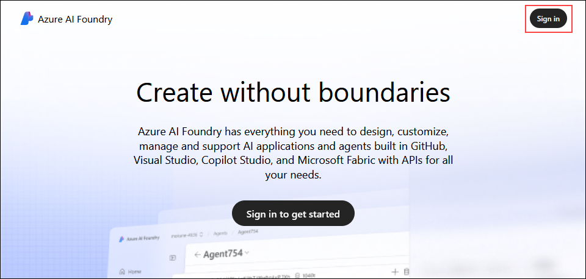

    - **Email/Username:** <inject key="AzureAdUserEmail"></inject>
    - **Password:** <inject key="AzureAdUserPassword"></inject>

1. On the **Azure AI Foundry**, on the home page, select **Create an agent**.

   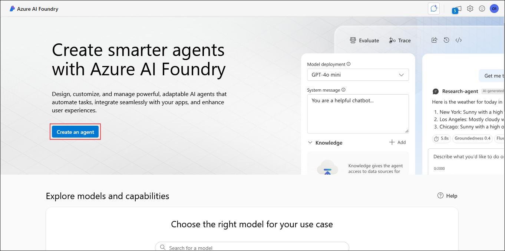

1. On the **Create a project** page, enter Project name as **modelproject-<inject key="DeploymentID" enableCopy="false"/>** **(1)** , select the **default subscription (2)**, select **ODL-MEMT-<inject key="DeploymentID" enableCopy="false"/> (3)** Resource Group, keep the default Azure AI Foundary resource name **(4)**. click on **Create (5)**.

    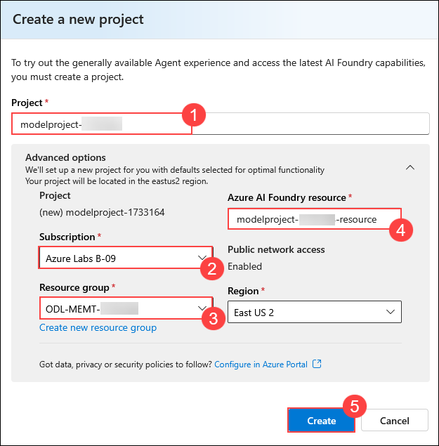

1. Let this project create completely. 

    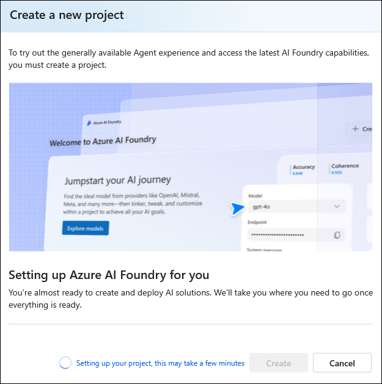

1. Navigate to the Azure Portal using the link below:

    ```
    https://portal.azure.com
    ```
1. Search and select **Azure AI Foundry** on the azure portal.

    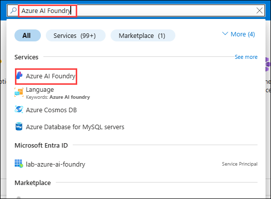

1. Once the **AI Foundry** page opens, select **AI Hubs (1)** under **Use with AI Foundry** from the left panel. Click on **+ Create (2)** and select **Hub (3)** from the drop down. 

    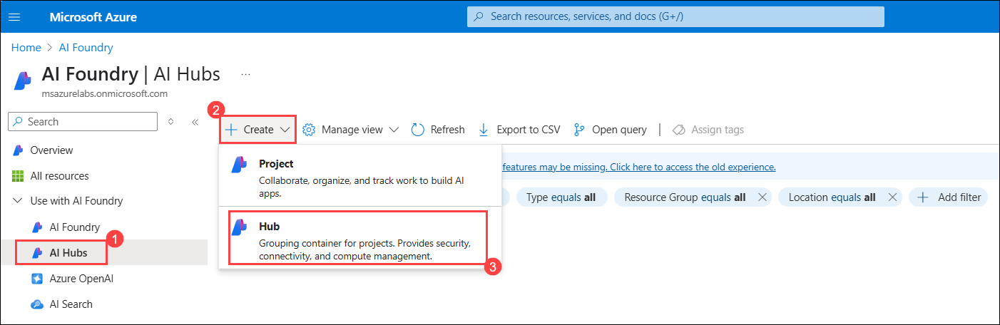

1. In the **Basics** tab of **Create an Azure AI hub resource**, follow these instructions to fill out the properties:

   - Subscription: **Set as default (1)**
   - Resource group: **ODL-MEMT-<inject key="DeploymentID" enableCopy="false"/>  (2)**  
   - Region: **<inject key="Region" enableCopy="false"/> (3)**
   - Hub name: **modelhub<inject key="DeploymentID" enableCopy="false"/>**  **(4)**.
   - Connect Azure AI Services incl. Azure OpenAI: **(new)ai-modelhub<inject key="DeploymentID" enableCopy="false"/>  (5)**
   - Review the details filled and click on **Review+Create (6)**.

    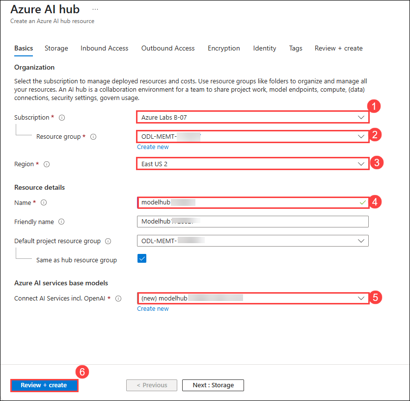

1. Click on **Create** once the validation passes to create the Hub. 

    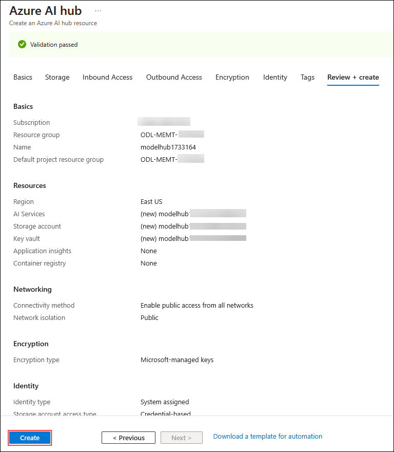

1. After the deployment gets suceeded, click on **Go to Resource**.

    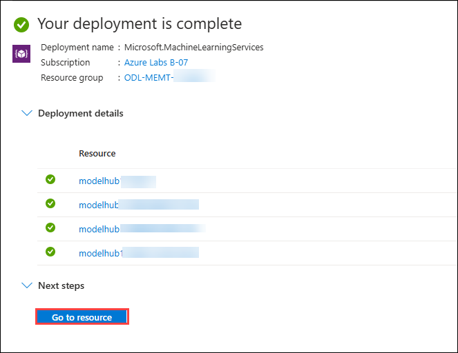

1. On the Azure AI hub page, select **Overview (1)** and click on **Launch Azure AI Foundry (2)** option visible. This will take you to the Azure AI Foundry portal. 

    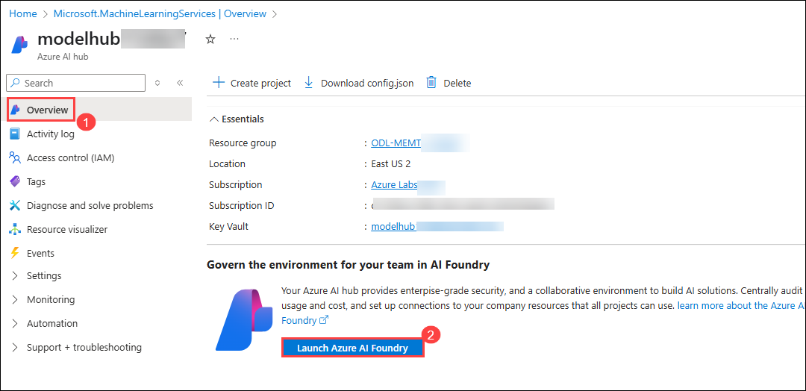

1. On the Azure AI Foundry portal, under Hub **Overview (1)**, select **+ New Project (2)**.

    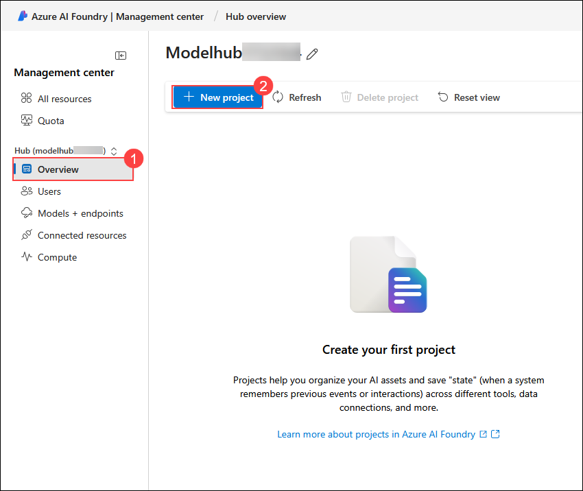

1. Let the **Current hub (1)** option load, provide the **project name** as **modelproject-<inject key="DeploymentID" enableCopy="false"/>** **(2)** and click on **Create (3)**. 

    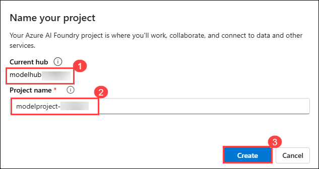

1. Once the project creation completes, you will be navigated inside that project. You will be performing further tasks in this project **modelproject-<inject key="DeploymentID" enableCopy="false"/>**.

    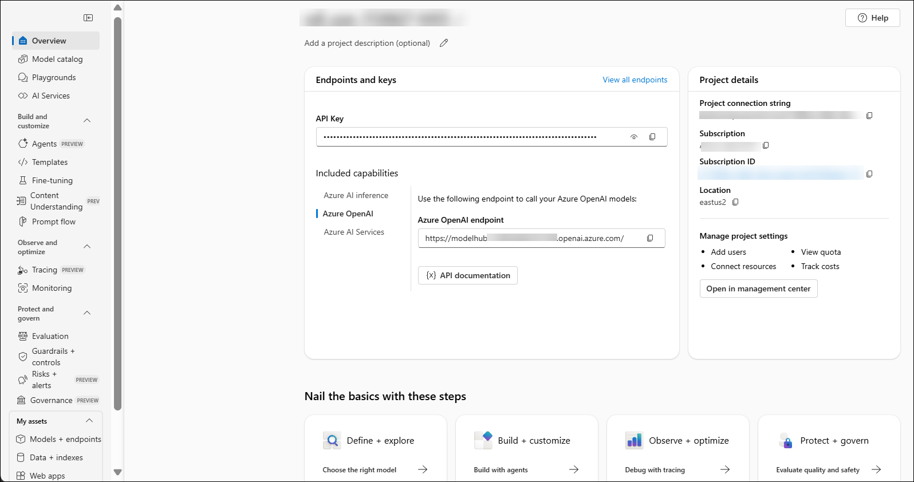

    > **Note:** If any pop-up appear, click on close.

      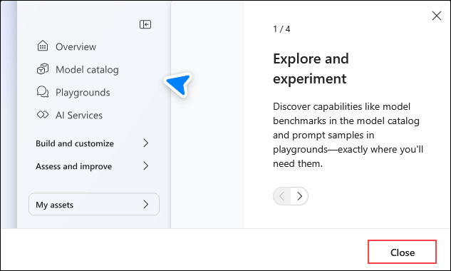
     
> **Congratulations** on completing the task! Now, it's time to validate it. Here are the steps:
> - Hit the Validate button for the corresponding task.
> - If you receive a success message, you can proceed to the next task.
> - If not, carefully read the error message and retry the step, following the instructions in the lab guide. 
> - If you need any assistance, please contact us at cloudlabs-support@spektrasystems.com. We are available 24/7 to help you out.

<validation step="57c4a434-0b5b-45a6-b178-0be8ef207607" />

### Task 2 : Create and Customize Prompts

In this task, you will focus on creating and customizing prompts by designing targeted and purposeful questions or statements that guide the LLM toward generating accurate and useful responses. You'll define clear objectives, consider the intended audience, and use precise language to ensure relevance. Customization will help align prompts with specific contexts or use cases, improving engagement and effectiveness in applications like education, customer support, and AI-driven workflows.

1. From the left navigation menu, under **My assets**, select **Model + endpoints (1)**.

1. On the **Manage deployments of your models and services**, under **Model deployments** tab, select **+ Deploy model (2)** and then select **Deploy base model (3)** from the dropdown.

   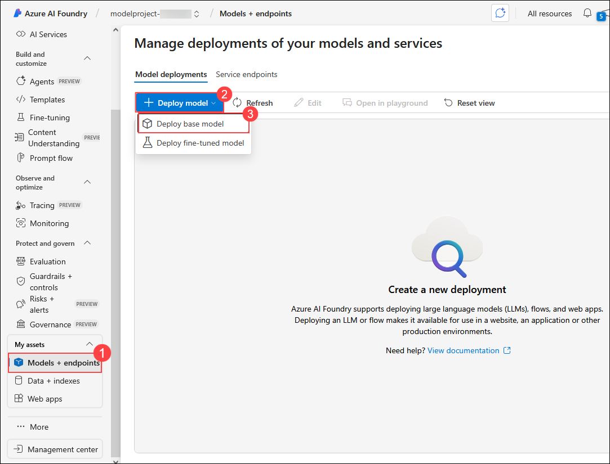

1. On the **Select a model** page, search for **gpt-4o (1)** and select **gpt-4o (2)**, select **Confirm (3)** under the **gpt-4o**.

   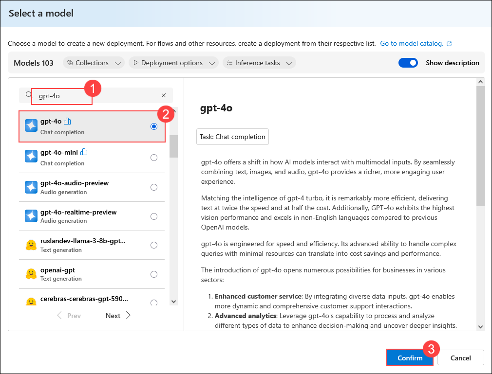

1. On **Deploy model gpt-4o** page :

    - Deployment name : **gpt-4o (1)**
    - Deployment type : **Global standard (2)**
    - Select **Customize (3)**

      

1. On **Deploy model gpt-4o** page, follow these instructions to create the deployment:

   - Deployment name : **gpt-4o (1)**
   - Deployment type :  **Global Standard (2)**
   - Model version : **2024-11-20 (3)**
   - Connected AI resource : make sure to select which contain your deployment id **ai-modelhub<inject key="DeploymentID" enableCopy="false"/>xxxxxxxx_aoai (4)**
   - Tokens per Minute Rate Limit (thousands): **5 K(5)**
      > **Note**: Use the &rarr; (right arrow) key on the keyboard to set the Enqueued Tokens (Limit) to 5k.
   - Content filter : **DefaultV2 (6)**
   - Select **Deploy (7)**

     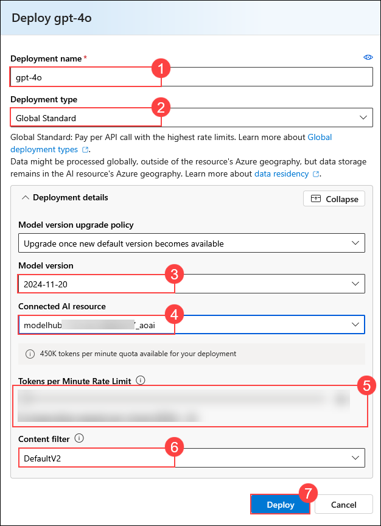

     >**Note:** If you see an error stating **"Failed to get the connection NotFoundError: Connection Default_AzureOpenAI can't be found in this workspace."** or a similar message, simply ignore it and refresh the page. Your model is already deployed.

1. From the left navigation pane, select **Prompt flow (1)** > **+ Create (2)** to add the Prompt tool to your flow.

   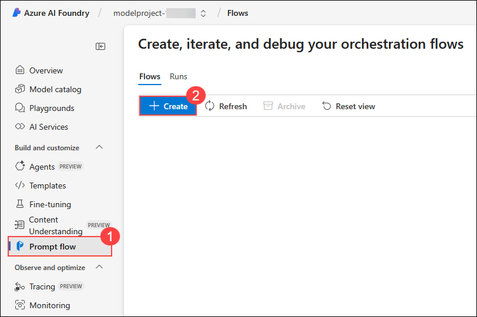

1. On **Create a new flow** blade, under **Standard flow**, click on **Create (1)**, then enter below provided Folder name, and click on **Create (3)**

   ```
   promptflow-<inject key="DeploymentID" enableCopy="false"/>
   ```

    >**Note**: **Please make sure to follow the note provided in the same step, just below the screenshot, as it addresses an error you may encounter while creating the Prompt Flow**.

     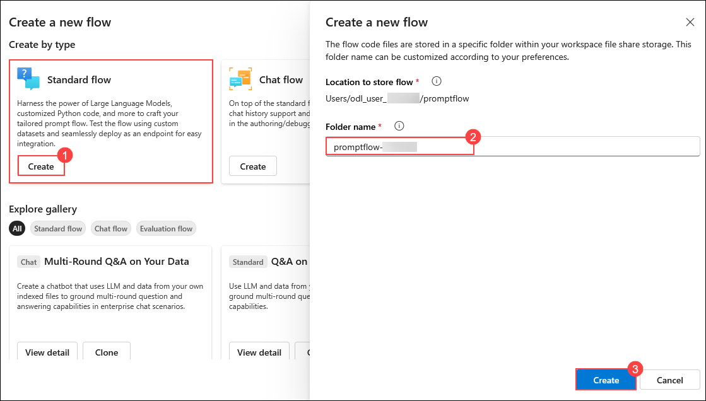

      >**Note:** If you encounter permission errors like "Cloud Dependency Permission" or see a "Folder name already exists" message, wait for 5 minutes and then try recreating the prompt flow using a unique name. Sometimes the system may not accept the original name, so try a few different variations until it succeeds. Once the flow is created, rename it to **promptflow-<inject key="DeploymentID" enableCopy="false"/> (2)** by selecting the **edit icon (1)** and click on **Save (3)**.

       

> **Congratulations** on completing the task! Now, it's time to validate it. Here are the steps:
> - Hit the Validate button for the corresponding task.
> - If you receive a success message, you can proceed to the next task.
> - If not, carefully read the error message and retry the step, following the instructions in the lab guide. 
> - If you need any assistance, please contact us at cloudlabs-support@spektrasystems.com. We are available 24/7 to help you out.
<validation step="1e9a4269-28c6-4a12-a16b-0ed96570d487" />

### Task 3 : Develop a Flow with LLM and Prompt Tools

In this task, you will develop a flow with Large Language Models (LLMs) and prompt tools by defining a clear objective, selecting the appropriate LLM, and crafting structured prompts to guide the model’s responses. You will iteratively refine these prompts based on the output to ensure accuracy and relevance. Prompt tools will help you manage and optimize the interaction, enabling efficient use of LLMs for tasks such as content creation, data analysis, or automated support.

1. The prompt flow authoring page opens. You can start authoring your flow now. By default you see a sample flow. This example flow has nodes for the LLM and Python tools.

1. Optionally, you can add more tools to the flow. The visible tool options are **LLM, Prompt, and Python**. To view more tools, select **+ More tools**.

    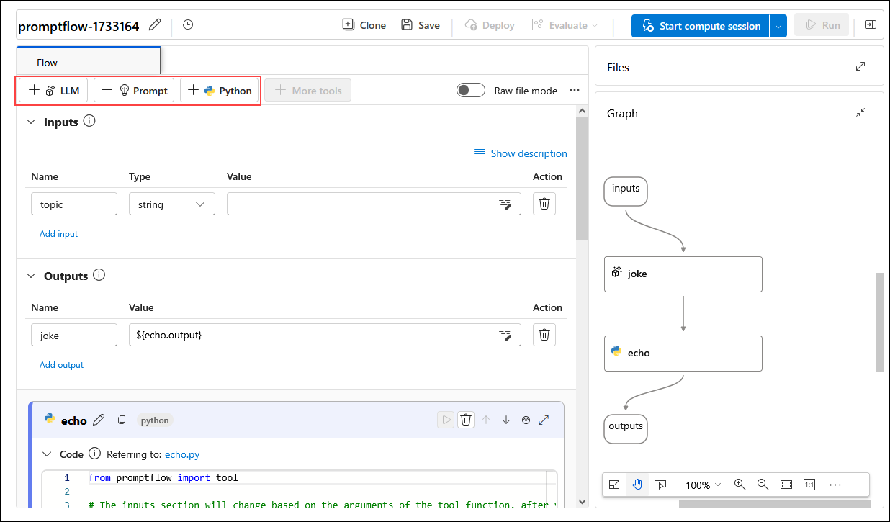

1. From the **Graph**, select **joke (1)**. Choose an existing connection **ai-modelhub<inject key="DeploymentID" enableCopy="false"/>xxxxxxxx_aoai (2)** from the drop-down menu, and for deployment, select the newly created deployment, **gpt-4o (3)**, in the LLM tool editor.

     

1. Scroll up, and for **Input**, enter any fruit name of your choice like **Apple (1)**.

    

1. Select **Save (1)**, and select **Start compute session (2)**.

    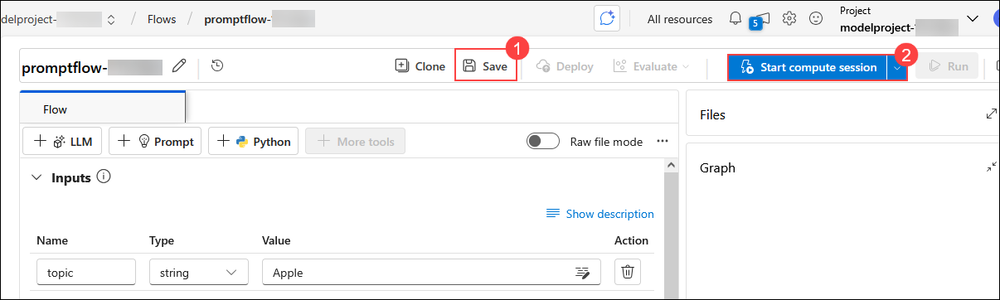

   >**Note:** Sometimes, it may take `10–15` minutes for the compute session to start. This delay is due to a portal glitch, so please be patient—there’s no alternative but to wait until the session becomes active. Once the compute session started, you can see as **Compute session running**

    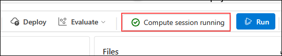
    
1. Once the compute session is complete, click the play button inside the **joke** node to run the **joke node** first, then run the **echo node**.

    

1. Click on the **echo (1)** node from the graph and click on the **Play (2)** button.

    
  
1. Once all nodes have successfully executed, select **Run** from the toolbar.

     

1. Once the flow run is completed, select **View outputs** to view the flow results. The output will look similar to the image as shown below.

     

1. You can view the flow run status and output in the **Outputs** section.

    

1. From the top menu, select **+ Prompt (1)** to add the Prompt tool to your flow, give the name of the flow as **modelflow (2)**, and select **Add (3)**.

   
   .png)

1. Add this code inside the **modelflow** prompt tool **(1)**, and select **Validate and parse input (2)**

   ```jinja
   Welcome to Joke Bot !
   
    Hello, {{ user_name }}!
   
    Hello there!
   
   Pick a category from the list below and get ready to laugh:
   1. 🐶 Animal Jokes – From pets to wildlife, it’s a zoo of laughs.
   2. 💼 Office Humor – Relatable jokes for the 9-to-5 grind.
   3. 💻 Tech & Programmer Jokes – Debug your mood with geeky giggles.
   4. 📚 School & Exam Jokes – A+ comedy for students and survivors.
   5. ⚡ One-Liners – Quick, witty, and straight to the funny bone.
   6. 😏 Sarcastic Jokes – Dry, sharp, and deliciously savage.
   ```

   

1. In the input section add these following value, select **Save (2)** and **Run (3)**.

   - user_name: **John (1)**

     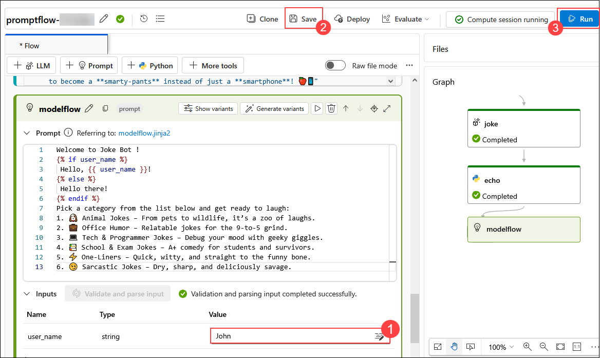

1. If you encounter any warnings while running, as shown in the screenshot below, click **Run Anyway**.

   

1. Once the flow run is completed, select View outputs to view the flow results. The output will look similar to the image as shown below.

   

1. You can view the flow run status and output in the Outputs section.

   
   
## Exercise 03: Evaluation Flow Setup

### Estimated Duration: 60 minutes

### Exercise Overview
In this exercise, you will set up an automated evaluation pipeline using built-in evaluation metrics and configure manual evaluation for deeper insights. You will begin by leveraging built-in metrics such as accuracy, precision, recall, and F1-score to assess model performance automatically. Then, you will set up a manual evaluation process where human reviewers can provide qualitative feedback on model outputs. This hands-on exercise will help you understand the integration of automated and manual evaluation methods to improve model accuracy and reliability.

### Exercise Objectives
In this exercise, you will perform the following:
- Task 1: Setup Manual Evaluation
- Task 2: Setup Automated Evaluation with Built-in Evaluation Metrics

### Task 1: Setup Manual Evaluation

In this task, you will set up a manual evaluation process to assess model performance. This involves defining evaluation criteria, collecting human feedback, and analyzing results to measure accuracy and identify potential biases. 

1. From the left navigation menu, under the **Protect and govern** section, select **Evaluation (1)**. On the **Assess and compare AI application performance** select **Manual evaluations (2)** tab. Select **+ New manual evaluation (3)**.

   

1. A new window opens with your **System message** already populated and your deployed **Model** already selected.

   

1. In the **Manual evaluation result** section, you'll add five inputs for which you will review the output. Enter the following five questions as five separate inputs by selecting **+ Add Inputs**:

   `Can you provide a list of the top-rated budget hotels in Rome?`

   `I'm looking for a vegan-friendly restaurant in New York City. Can you help?`

   `Can you suggest a 7-day itinerary for a family vacation in Orlando, Florida?`

   `Can you help me plan a surprise honeymoon trip to the Maldives?`

   `Are there any guided tours available for the Great Wall of China?`

1. Select **Run** from the top bar to generate outputs for all questions you added as inputs.

    

1. You can now manually review the **Outputs** for each question by selecting the thumbs up or down icon at the bottom right of a response. Rate each response, ensuring you include at least one thumbs up and one thumbs down response in your ratings.

   

   > **Note:** If you receive an error in any of the output while executing the run "exceeded token rate limit of your current AIService", then please rerun the failed ones after couple of minutes.

1. Select **Save results (1)** from the top bar. Enter **manual_evaluation_results (2)** as the name for the results, and select **Save (3)**.

   
   
1. Using the menu on the left, navigate to **Evaluations (1)**. Select the **Manual evaluations (2)** tab to find the manual evaluations you just saved **(3)**. Note that you can explore your previously created manual evaluations, continue where you left of, and save the updated evaluations.

   

### Task 2: Setup Automated Evaluation with Built-in Evaluation Metrics

In this task, you will configure automated evaluation using built-in metrics to measure model performance quickly and accurately.

1. From the left navigation menu, under the **Protect and govern** section, select **Evaluation (1)**. On the **Assess and compare AI application performance** select **Automated evaluations (2)** tab. Select **Create a new evaluation (3)**.

   

1. On the **Create a new evaluation** pane, select **Ecaluate an existing query-response dataset (1)** and click on **Next (2)**.

   

1. Open a new tab and paste the new link **https://raw.githubusercontent.com/MicrosoftLearning/mslearn-ai-studio/main/data/travel-qa.jsonl** JSONL file. press **Ctrl A** 
      and **Ctrl C** to select all and **Copy**.
  
    - Search for **Visual Studio Code (1)** in the Windows search bar of the vm and select **Visual Studio Code (2)**.

       

    - From the **File (1)** menu, select **New Text File (2)**, 

       

    - **Paste the copied code**.

    - Navigate to **File (1)** and click on **Save as (2)**.    

           

    - Click on **Desktop (1)**, Enter the File name as **Sample (1)** select **JSON Lines (3)** for Save as type and then click on **Save (4)**.

       

      > **Note:** Make sure to select the correct file type. The AI Foundry portal only accepts files in the **JSON Lines** format. If any other file type is selected, the file will not be accepted.

1. Navigate back to **Azure AI foundry**, where your **creating a new evaluation**.
   
    - **Configure test data**: select **Upload new dataset**
  
         

    - Navigate to **Desktop (1)**, select the file **Sample.jsonl** **(2)** and Click on **Open** **(3)**.

            

    - Select **Next** 

    - **Configure Evaluators**: Click on **+ Add** and select **Likert-scale evaluator**
      
      
      
      
    - Select **Coherence (1)** and below in Query select **{{item.query}}** **(2)** and for Response select **${item.response}** **(3)** and click on **Add (4)**.

      

    - **Configure Evaluators**: Click on **+ Add** and select **Likert-scale evaluator**
      
      
      

    - Select **Fluency (1)** and below in Query select **{{item.query}}** **(2)** and for Response select **${item.response}** **(3)** and click on **Add (4)**.

      
    
    - Once added, click on Next.

      

   - Now, update model evaluation name to  **Modelevaluation-<inject key="DeploymentID" enableCopy="false"/> (1)** and click on **Submit (2)**.
     
     
     
   
1. Wait until the evaluation status changes to **Completed**. If the status shows **Queued** or **Running**, you may need to refresh the page to see the latest update.

   

1. Select **Evaluation (1)** from the left navigation menu, and under **Automated Evaluation (2),** choose the newly created evaluation run **(3)**.

   

1. Under the **Report** tab, scroll down to explore the **Metric dashboard**.

    

1. Navigate to **Data (1)** tab from the top menu to view the **Detailed metrics results (2)**.    

    

## Exercise 04: Fine-Tuning Prompts for Optimal Performance

## Estimated Duration: 60 minutes

## Exercise Overview
In this hands-on lab, you will explore fine-tuning prompts for optimal performance, learning how to craft precise and effective input queries that maximize the accuracy, relevance, and efficiency of AI-generated responses. You will experiment with structuring prompts to guide AI behavior, incorporating context, constraints, and desired output formats to achieve more consistent results. By iterating on prompt design and analyzing AI responses, you will develop best practices for refining inputs to suit various use cases, from summarization and data extraction to creative writing and technical problem-solving.
 
## Exercise Objectives
In this exercise, you will perform the following:
- Task 1: Perform Iterative Prompt Tuning and Variant Comparison
- Task 2: Optimize Flow Performance for Production

### Task 1: Perform Iterative Prompt Tuning and Variant Comparison 

In this task, you will refine model responses by adjusting prompts over successive iterations. This process enables systematic evaluation and comparison of output variants, helping to ensure that each iteration leads to improved performance and more accurate, relevant responses.

1. On the [Azure AI foundry](https://ai.azure.com/?reloadCount=1), under **Build and customize** section select **Prompt flow (1)**. Select **+ Create (2)** to open the flow creation wizard.

   

1. In the **Create a new flow** pane, under **Explore gallery**, in the **Web Classification** box, select **Clone**.

     

1. On the **Clone Flow** page, enter name **Web Classification-<inject key="DeploymentID" enableCopy="false"/> (1)** and click on **Clone (2)**.

      

1. Scroll down to **classify_with_llm (1)** node and select the following:

    - Connection : Select the connection **modelhub<inject key="DeploymentID" enableCopy="false"/>xxxxxxxx_aoai (2)**

    - deployment_name : **gpt-4o (3)**

      
   
1. Replace the existing prompt with the following prompt as a baseline prompt in the classify_with_llm node.

   ```
   # system:
   Your task is to classify a given URL into one of the following types:
   Movie, App, Academic, Channel, Profile, PDF, or None based on the text content information.
   The classification will be based on the URL, the webpage text content summary, or both.

   # user:
   For a given URL: https://arxiv.org/abs/2303.04671, and text content: Visual ChatGPT is a system that enables users to interact with ChatGPT by sending and receiving not only languages but also images, providing complex visual questions or visual editing instructions, and providing feedback and asking for corrected results. It incorporates different Visual Foundation Models and is publicly available. Experiments show that Visual ChatGPT opens the door to investigating the visual roles of ChatGPT with the help of Visual Foundation Models. 
   Classify the above URL to complete the category and indicate evidence.
   ```

       

1. Select **Show variants** button on the top right of the LLM node. The existing LLM node is variant_0 and is the default variant.

      

1. Select the **Clone** button on variant_0 to generate variant_1, then we can configure parameters to different values on variant_1

     
   
1. Scroll down, on the **variant_1** replace the existing prompt with the following prompt:

    ```  
    # system:  
    Your task is to classify a given URL into one of the following types:
    Movie, App, Academic, Channel, Profile, PDF, or None based on the text content information.
    The classification will be based on the URL, the webpage text content summary, or both.

    # user:
    For a given URL: https://play.google.com/store/apps/details?id=com.spotify.music, and text content: Spotify is a free music and podcast streaming app with millions of songs, albums, 
    and original podcasts. It also offers audiobooks, so users can enjoy thousands of stories. It has a variety of features such as creating and sharing music playlists, discovering new 
    music, and listening to popular and exclusive podcasts. It also has a Premium subscription option which allows users to download and listen offline, and access ad-free music. It is 
    available on all devices and has a variety of genres and artists to choose from.
    Classify the above URL to complete the category and indicate evidence.

    ```

    
     
1. Select **Hide variants** to stop adding more variants. All variants are folded. The default variant is shown for the node. For classify_with_llm node, based on variant_0:

     

1. Scroll up to **summarize_text_content** node and select the following 

   - Connection : Select the connection **modelhub<inject key="DeploymentID" enableCopy="false"/>xxxxxxxx_aoai (1)**

   - deployment_name : **gpt-4o (2)**

1. Replace the existing prompt with the following prompt as a baseline prompt in summarize_text_content node, based on variant_0, you can create variant_1 **(3)**.  
     
   ```  
   # system:
   Please summarize the following text in one paragraph. 100 words.
   Do not add any information that is not in the text.

   # user:
   Text: The history of the internet dates back to the early 1960s, when the idea of a global network of computers was first proposed. In the late 1960s, the Advanced Research Projects 
   Agency Network (ARPANET) was developed by the United States Department of Defense. It was the first operational packet-switching network and the precursor to the modern internet. The 
   1970s and 1980s saw the development of various protocols and standards, such as TCP/IP, which allowed different networks to communicate with each other. In the 1990s, the invention 
   of the World Wide Web by Tim Berners-Lee revolutionized the internet, making it accessible to the general public. Since then, the internet has grown exponentially, becoming an 
   integral part of daily life for billions of people around the world.

   assistant:
   Summary:
   ```

1. Select **Show variants (4)** button on the top right of the LLM node. The existing LLM node is variant_0 and is the default variant.

    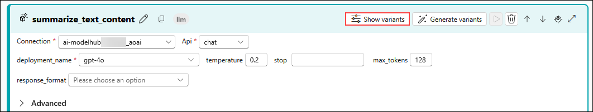
   
1. Select the **Clone** button on **variant_0** to generate variant_1, then we can configure parameters to different values on variant_1

1. Scroll down, on the **variant_1** replace the existing prompt with the following prompt:

   ```
   # system:
   Please summarize the following text in one paragraph. 100 words.
   Do not add any information that is not in the text.

   # user:
   Text: Artificial intelligence (AI) refers to the simulation of human intelligence in machines that are programmed to think and learn. AI has various applications in today's society, 
   including robotics, natural language processing, and decision-making systems. AI can be categorized into narrow AI, which is designed for specific tasks, and general AI, which can 
   perform any intellectual task that a human can. Despite its benefits, AI also poses ethical concerns, such as privacy invasion and job displacement.

   assistant:
   Summary:

   ```

    

1. Click the **Save (1)** button from the top menu, then select **Start Compute Session (2)**.

    

     >**Note:** It might take 10-15 minutes to start the session. Wait till compute session starts.    

1. Finally, click the **Run** button in the top right corner.

    

1. On the Submit flow run window open under **Select the LLM node with variants that you want to run** choose **Select a node to run variants** then select **summarize_text_content (1)**, and click on **Submit (2)**. 

   
   
1. Once the session runs successfully, review the output by selecting each variant.

1. In top menu select **Variant 0 (1)** from the drop down and select **View full output (2)** for **summarize_text_content** for **variant 0**. Now, review the output of the variant, that you selected.

   

   

   >**Note:** The output shown in the image may differ in your lab.

### Task 2: Optimize Flow Performance for Production 

In this task, you will analyze and refine workflow processes to ensure maximum efficiency and minimal downtime. This includes identifying bottlenecks, applying best practices, and leveraging advanced tools and technologies to streamline operations. You will also implement continuous monitoring and iterative improvements to maintain high performance and adapt to evolving production demands, ultimately enhancing productivity and reducing operational costs.

1. Under **Inputs**, click on **+ Add input** then add **category** and **text-context**. 

    

1. Under **Output**, click on **+ Add output** then add **category** and **evidence** **(1)**. Click on **Save (2)**.

    

     >**Note:** In the Output section, if the outputs are already added, please check for the **values** and then select **Save**.
   
1. Select **Evaluate (1)** > **Custom Evaluation (2)**.

   

1. On the **Batch run & Evaluate** give **Run display name** as **classify-<inject key="DeploymentID" enableCopy="false"/> (1)**, then under **Variants** select **classify_with_llm (2)**, and click on **Next (3)**.

   

1. On the **Batch run settings** select **+ Add new data**.

   

1. On the **Add new data** window open, enter name  **classify_with_llm_data_set (1)** select **Upload from local file (2)** and click on **Browse (3)**.

   

1. Navigate to `C:\LabFiles\Developing-AI-Applications-with-Azure-AI-Studio\Labs\data` press **Enter** **(1)**, then select **classify.jsonl (2)** file and click on **Open (3)**.

     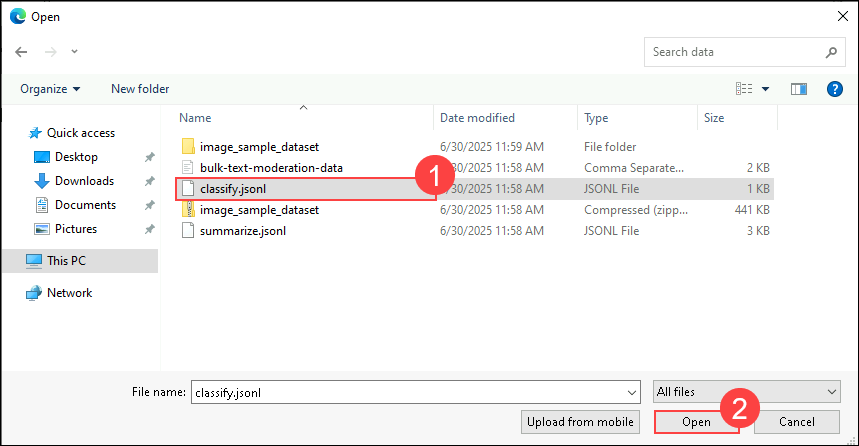

1. Click on **Add**.

     

1.  Select **${data.text-context} (1)** for **text-context** and select **Next (2)**.

     
   
1. On the **Select evaluation** page, select **Classification Accuarancy Evaluation (1)** and click on **Next (2)**.

   

1. On the **Configure evaluation** page, expand **Classification Accuracy Evaluation (1)** and select **classify_with_llm_data_set (Version 1) (2)**. For the **groundtruth** data source, select **category (3)** under the **Data input**, and for **prediction**, select **category (4)** under the **Flow output**, then select **Next (5)**.

     

1. On **Review** page review the settings and click on **Submit**.

     

1. Back on Prompt flow page and from top click on **View run list** link.

    
   
1. After the batch run and evaluation run **complete**, in the run detail page, **multi-select the batch runs for each variant (1)**, then select **Visualize outputs (2)**. You will be able to see the metrics of 2 variants for the classify_with_llm node and LLM, along with predicted outputs for each recorded data.

   

1. After you identify which variant is the best, you can go back to the flow authoring page and set that variant as default variant of the node

1. Now will evaluate the variants of **summarize_text_content** node as well.

1. Back on the **Prompt flow** page, under the **Input** section, remove all inputs except **url**, then click on **+ Add input** and enter **Text**. 

   

1. Under the **Outputs** section, delete the existing outputs, click on **+ Add output**, then add **Summary** and set the value as **${summarize_text_content.output}**. Also, add **url** and set the value as **${inputs.url}** **(1)** and then click on **Save (2)**

   

1. Select **Evaluate (1)** and then select **Custom Evaluation (2)**.

   

1. On the Batch run & Evaluate give **Run display name** as **summarize_text_content-<inject key="DeploymentID" enableCopy="false"/> (1)**, then under variants select **Use default variants for all nodes (2)**, and select **summarize_text_content (3)** click on **Next (4)**.

   

1. On the Batch run settings, click on **+ Add new data**.

1. In the new data window, enter name  **summarize_text_content_data_set (1)** select **Upload from local file (2)** and click on **browse (3)**.

   

1. Navigate to  `C:\LabFiles\Developing-AI-Applications-with-Azure-AI-Studio\Labs\data` **(1)**, then select **summarize.jsonl (2)** file  and then click on **Open (3)**.

   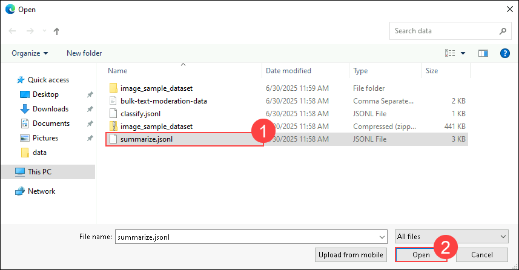

1. Click on **Add**.

   

1. Under **Input mapping** for **url** select **${data.text} (1)**, and for **text** select **${data.text} (2)**. Select **Next (3)**.

   

1. On the **Select evaluation** page select **Classification Accuarancy Evaluation (1)** and click on **Next (2)**.

   

1. On the **Configure evaluation** page, expand **Classification Accuracy Evaluation (1)**, select **summarize_text_content_data_set(Version 1) (2)**, and ensure that the **groundtruth** data source is set to **summary (3)** under the **Data input** section. For **prediction**, select **summary (4)** under the **Flow output**, and then click on **Review + submit (5)**.

    

    >**Note:** If you're not seeing the option for the Dataset column, try changing the data column from `summarize_text_content_data_set` to any other column, and then reselect `summarize_text_content_data_set`. This should refresh the options.

1. On **Review** page review the settings and click on **Submit**.

    .png)

1. Back on Prompt flow page and from top click on **View run list** link.

   
   
1. After the batch run and evaluation run **complete**, in the run detail page, **multi-select (1)** the batch runs for each variant, then select **Visualize outputs (2)**. You will see the metrics of 2 variants for the classify_with_llm node and LLM predicted outputs for each record of data.

   

1. After you identify which variant is the best, you can go back to the flow authoring page and set that variant as default variant of the node

## Exercise 05: Implementing Chat Flow and Tool Integration

### Estimated Duration: 60 minutes

### Exercise Overview
In this exercise, you will be designing and implementing a chat flow to interact with a deployed language model. You'll start by creating a basic chat flow using Azure AI foundry, which includes integrating inputs, an LLM node, and configuring the output to reflect chat responses. You will then test the chat flow, ensure it functions correctly, and deploy it to a production environment. The final steps involve verifying the deployment, testing the deployed flow with sample queries, and exploring options for integrating the chat flow into applications as a custom copilot.

### Exercise Objectives
In this exercise, you will perform the following:
- Task 1: Design and Implement a Chat Flow
- Task 2: Use LLM and Prompt Tools in Flows

### Task 1: Design and Implement a Chat Flow

In this task, you will design and implement a chat flow using Azure AI Foundry to interact with a deployed language model. You will test its functionality to ensure accurate and relevant responses, and prepare the chat flow for deployment in a production environment.

1. From the left navigation menu, under **My assets**, select **Model + endpoints (1)**.

1. On the **Manage deployments of your models, apps, and services**, under **Model deployments** tab, select **+ Deploy model (2)** and then select **Deploy base model (3)** from the dropdown.

   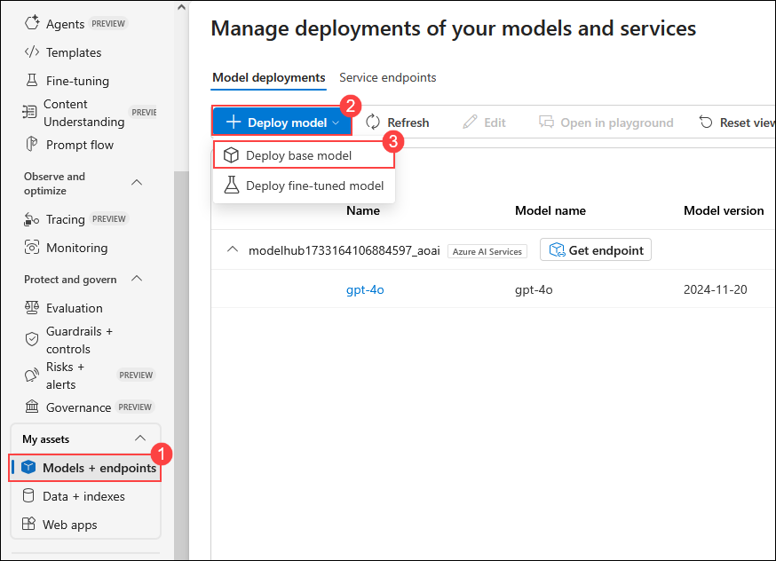

1. On the **Select a model** page, search for **gpt-35-turbo (1)**, select **gpt-35-turbo (2)**, select **Confirm (3)** under the **gpt-35-turbo**.

   

1. On **Deploy model gpt-35-turbo**, click on **Customize**.

   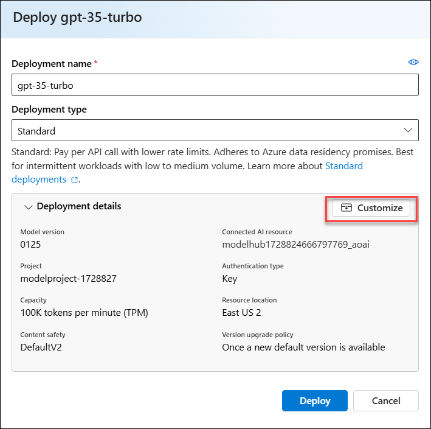

1. On **Deploy model gpt-35-turbo** follow these instructions to create the deployment:
   
   - Deployment Name : **gpt-35-turbo (1)**
   - Deployment type: **Standard (2)**
   - Model version: **0125 (Default) (3)**
   - Connected AI resource: select the resource which we created in earlier task **(4)**
   - Tokens per Minute Rate Limit: **10K (5)**
   - Content filter: **DefaultV2 (6)**
   - Enable dynamic quota: **Enabled (7)**
   - Select **Deploy (8)**

     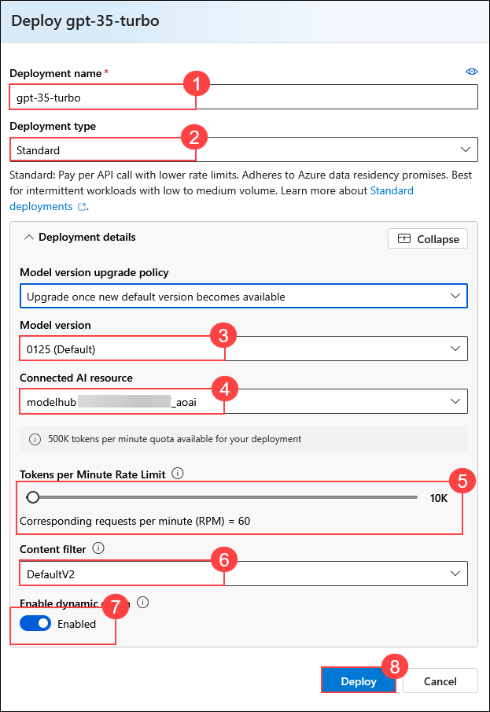
     
1. On the [Azure AI foundry](https://ai.azure.com/?tid=f9733b59-6ed1-4cb1-a5c4-55f5c0d6ad6f), under **My assets**, select **Model + endpoints (1)**. On the **Model + deployments** page select **gpt-35-turbo (2)** then click **Open in playground (3)**

    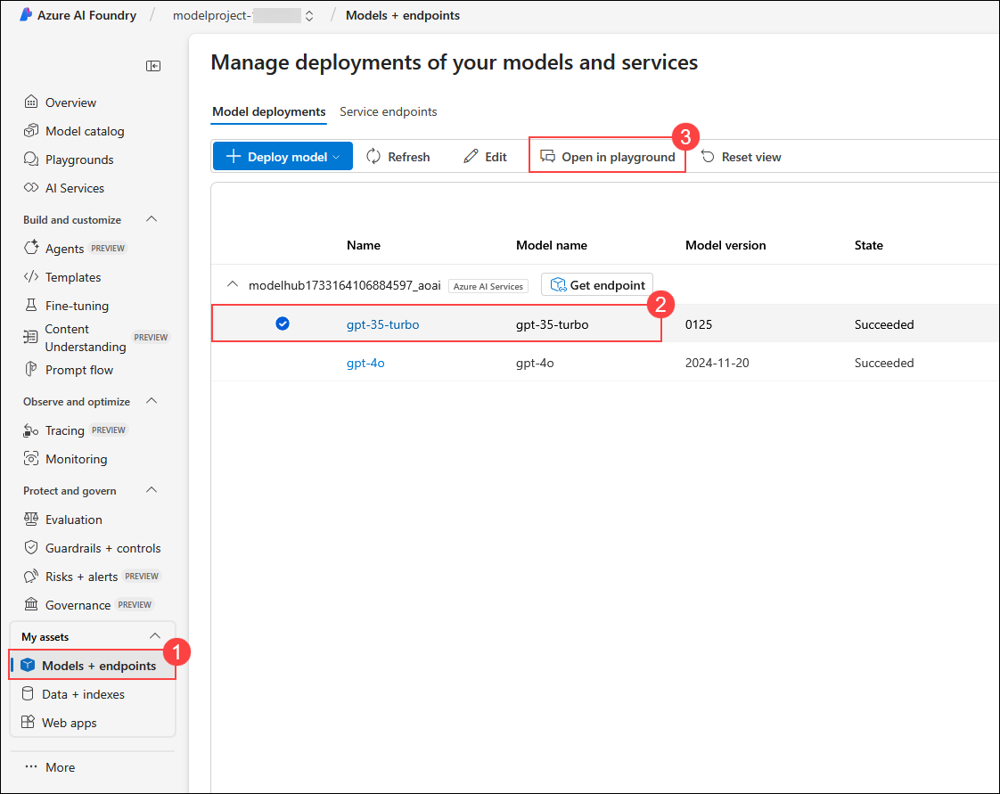

1. In the chat window, enter the query **What can you do?**.

   >**Note:** The answer is generic because there are no specific instructions for the assistant. To make it focused on a task, you can change the system prompt.
   > Wait for 2-3 mins if you get an error while querying.
   
     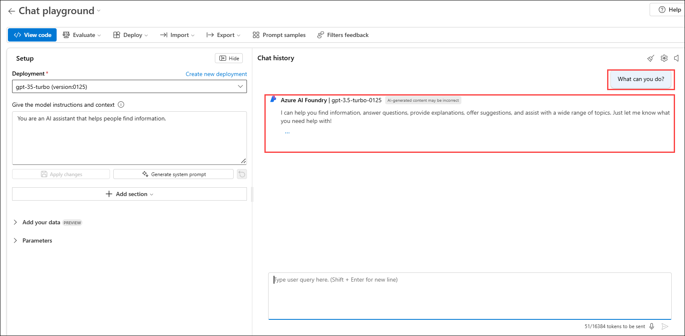

   >**Note:** The output will be different; it will not be the same. However, it will look similar to the screenshot.

1. Update the **Give the model instructions and context (1)** to the following:-

   ```
   **Objective**: Assist users with travel-related inquiries, offering tips, advice, and recommendations as a knowledgeable travel agent.

   **Capabilities**:
   - Provide up-to-date travel information, including destinations, accommodations, transportation, and local attractions.
   - Offer personalized travel suggestions based on user preferences, budget, and travel dates.
   - Share tips on packing, safety, and navigating travel disruptions.
   - Help with itinerary planning, including optimal routes and must-see landmarks.
   - Answer common travel questions and provide solutions to potential travel issues.
    
   **Instructions**:
   1. Engage with the user in a friendly and professional manner, as a travel agent would.
   2. Use available resources to provide accurate and relevant travel information.
   3. Tailor responses to the user's specific travel needs and interests.
   4. Ensure recommendations are practical and consider the user's safety and comfort.
   5. Encourage the user to ask follow-up questions for further assistance.

   ```
   
1. Select **Apply changes (2)** and when **Update system message?** pop-up appears, click on **Continue**.

        

1. In the chat window, enter the same query as before: **What can you do?**. Note the change in response.

     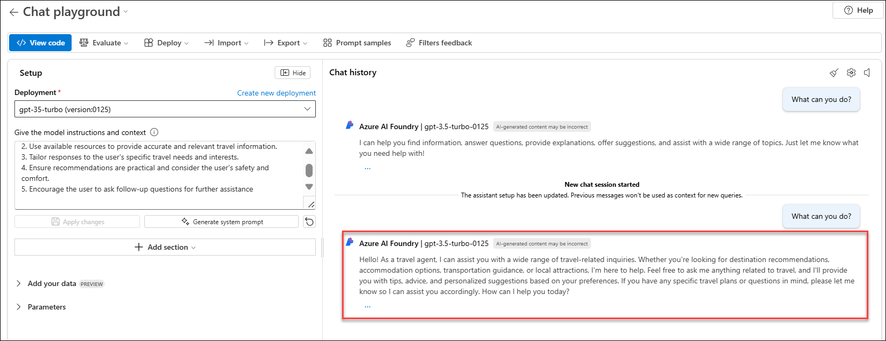

     >**Note:** The output will be different; it will not be the same. However, it will look similar to the screenshot.

1. From the left navigation pane, select **Prompt flow (1) > + Create (2)** to add the Prompt tool to your flow.

   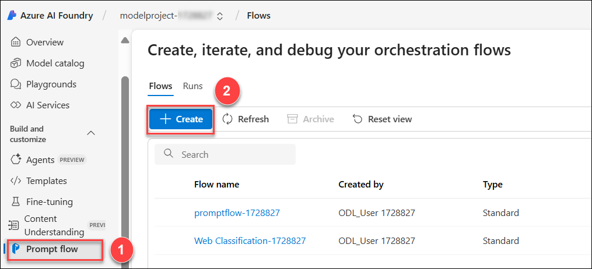

1. On **Create a new flow** blade, under **Chat flow**, click on **Create (1)**, then enter **Travel-Chat (2)** for Folder name, then click on **Create (3)** 

   

1. A simple chat flow is created for you. Note there are two inputs (**chat history and the user’s question**) **(1)**, an LLM node that will connect with your deployed language model, and an output to reflect the response in the chat **(2)**.

   

1. To be able to test your flow, you need compute. Select **Start compute session** from the top bar.

   
   
   >**Note:** The compute session will take 1-3 minutes to start.
   
1. Select the LLM node named **chat**. Update the system message like below:

   ```
   system:
   **Objective**: Assist users with travel-related inquiries, offering tips, advice, and recommendations as a knowledgeable travel agent.
   
   **Capabilities**:
   - Provide up-to-date travel information, including destinations, accommodations, transportation, and local attractions.
   - Offer personalized travel suggestions based on user preferences, budget, and travel dates.
   - Share tips on packing, safety, and navigating travel disruptions.
   - Help with itinerary planning, including optimal routes and must-see landmarks.
   - Answer common travel questions and provide solutions to potential travel issues.
   
   **Instructions**:
   1. Engage with the user in a friendly and professional manner, as a travel agent would.
   2. Use available resources to provide accurate and relevant travel information.
   3. Tailor responses to the user's specific travel needs and interests.
   4. Ensure recommendations are practical and consider the user's safety and comfort.
   5. Encourage the user to ask follow-up questions for further assistance.
   
   
   user:
   {{item.inputs.question}}
   assistant:
   {{item.outputs.answer}}
   
   
   user:
   {{question}}
   ```

   

1. Select **Save**.

   

1. You still need to connect the LLM node to your deployed model. In the top of the**LLM node** section, you need to select the connection from teh drop down list and proceed as below.

   - **Connection**: Select the connection that was newly created for you when you created the **gpt-35-turbo** **(1)** deployment. 
   - **Api**: Select **chat (2)**.
   - **deployment_name**: Select the **gpt-35-turbo (3)** model you deployed.
   - **response_format**: Select **{“type”:”text”} (4)**.

     
   
### Task 2: Use LLM and Prompt Tools in Flows

In this task, you will use the chat window to test the developed flow by leveraging built-in LLM and prompt tools within Azure AI Foundry. This will help you validate the flow's behavior, experiment with prompt tuning, and ensure the language model responds accurately within the defined interaction patterns.

1. Ensure the compute session is running. Select **Save (1)**. Select **Chat (2)** to test the flow.

   

1. Enter the query: **I have one day in London, what should I do?** and review the output.

   

   >**Note:** The output will be different; it will not be the same. However, it will look similar to the screenshot.

1. Select **Deploy** to deploy the flow with the following settings:

   
   
   - Basic settings:
     - Endpoint: **New (1)**
     - Endpoint name: **modelendpoint-<inject key="DeploymentID" enableCopy="false"/> (2)**
     - Deployment name: **modeldeploy-<inject key="DeploymentID" enableCopy="false"/> (3)**
     - Virtual machine: **Standard_DS3_v2 (4)**
     - Instance count: **3 (5)**
     - Inferencing data collection: **Enabled (6)**
     - Select **Review + Create (7)**

         

1. Review the configurations and then select **Create**.

   

1. In Azure AI foundry, from the left navigation pane, under **My assets**, select **Model + endpoints**

   >**Note:** Select **Save** if your flow is not saved.

1. Select the **Model deployments (1)** tab to find your deployed flow. It may take some time before the deployment is listed and successfully created. When the deployment has succeeded, select the newly created deployment **(2)**.

   

   > **Note:** It might take 3-5 minutes to deploy.

1. Wait untill the **Provisioning state** become **Succeeded (1)**, then only you will get the **Test (2)** tab.

   

1. Navigate to **Test** tab, enter the prompt **What is there to do in San Francisco?** in the input question (string) section and review the response.

     

     >**Note:** If the **Test** tab is not opening, wait for 3-5 minutes, refresh the page and try again. 

     >**Note:** The output will be different; it will not be the same. However, it will look similar to the screenshot.

1. Enter the prompt **Where else could I go?** and review the response.

     

     >**Note:** The output will be different; it will not be the same. However, it will look similar to the screenshot.

1. View the **Consume** page for the endpoint, and note that it contains connection information and sample code that you can use to build a client application for your endpoint - enabling you to integrate the prompt flow solution into an application as a custom copilot.

   

> **Congratulations** on completing the task! Now, it's time to validate it. Here are the steps:
> - Hit the Validate button for the corresponding task.
> - If you receive a success message, you can proceed to the next task.
> - If not, carefully read the error message and retry the step, following the instructions in the lab guide. 
> - If you need any assistance, please contact us at cloudlabs-support@spektrasystems.com. We are available 24/7 to help you out.

<validation step="7221578e-67fa-4377-9fd2-ec0b05448f2b" />


## Exercise 06: Ensuring Responsible AI Practices with Content Safety 

## Estimated Duration: 60 minutes

## Exercise Overview
This lab provides hands-on experience in implementing responsible AI practices using Azure AI Foundry. Participants will gain insights into fairness, transparency, privacy, and security considerations while leveraging Azure’s built-in Responsible AI tools. The lab focuses on detecting and mitigating biases, ensuring model interpretability, applying privacy-preserving techniques, and enforcing security and compliance best practices.

## Exercise Objective
In this exercise, you will perform the following:

- Task 1 : Image and Text Moderation Using Azure AI foundry

### Task 1 : Image and Text Moderation Using Azure AI Foundry

In this task, you will use Azure AI Foundry to moderate both images and text by detecting inappropriate, harmful, or sensitive content. You will leverage AI models to analyze and filter content according to predefined moderation policies, helping ensure compliance, user safety, and responsible AI use within your application.

1. On the **Azure AI Foundry** portal, select **Guardrails + controls (1)** under **Protect and govern**, then select **Try it Out (2)**.

     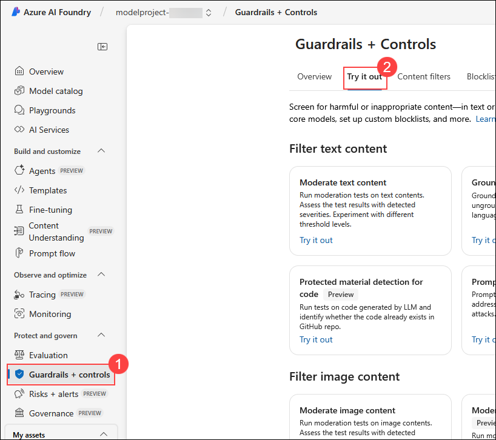     

2. Scroll down, under **Filter image content (1)** option, select **Moderate image content (2)**.

     

3. On **Moderate image content** select **Run a simple test (1)** tab, review the options note we have three set content  **Safe content**, **self- harm content** and **AI-generated sexual content**. **(2)**

     

#### Safe content

1. Before starting, select the below **Azure AI services**, and proceed with lab using this Azure AI services.

     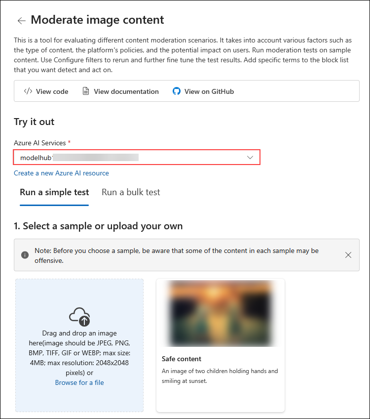

1. Now let's use our image and test then check the result. On the **Run a simple test** tab, select **Safe content (1)** then click on **Browse for a file (2)**

     

1. Within **file explorer** navigate to `C:\LabFiles\Developing-AI-Applications-with-Azure-AI-Studio\Labs\data\image_sample_dataset` **(1)** press **Enter**, then select **family-builds-campfire.jpg (2)** and click on **Open (3)**. 

     

1. Review the image and click on **Run test**.

    
   
1. Review the result. As expected, this image content is **Allowed**, and the Severity level is Safe across all categories. 

    

   >**Note**: So far, we’ve tested image content for singular isolated images. However, if we have a bulk dataset of image content, we could test the bulk dataset at once and receive metrics based on the model’s performance.

#### Self harmed content

We should also anticipate customers potentially posting harmful image content. To ensure that we account for such a scenario, let’s test the detection of harmful image content.

1. Select **Self harmed content (1)** and click on **Browse for a file (2)**.

    

1. Within **file explorer** navigate to `C:\LabFiles\Developing-AI-Applications-with-Azure-AI-Studio\Labs\data\image_sample_dataset` **(1)** then select the **bear-attack-blood.JPG (2)** file and then click on **Open (3)**.

    

1. Set all Threshold levels to **Medium (1)** and then select **Run test (2)**.

    

    >**Note**: Rightfully so, the content is Blocked, and was rejected by the Violence filter which has a Severity level of High.

     

#### Task 1.2: Run a bulk test

So far, we’ve tested image content for singular isolated images. However, if we have a bulk dataset of image content, we could test the bulk dataset at once and receive metrics based on the model’s performance.

1. On **Moderate image content** select **Run a bulk test (1)** tab then click on **Browse for a file (2)**.

     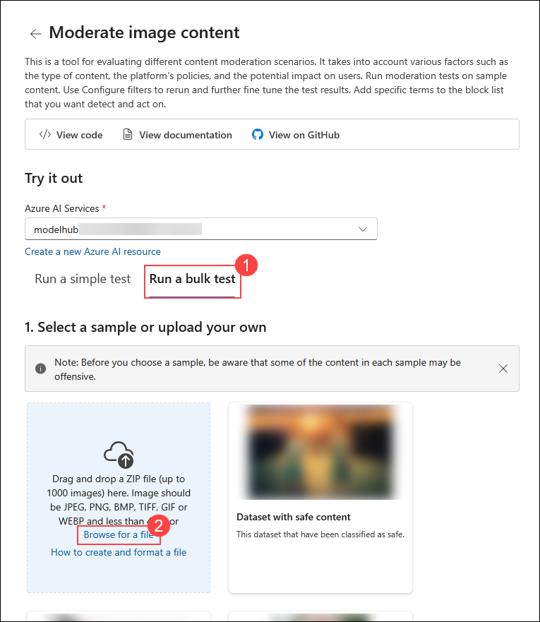

1. Within file explorer navigate to `C:\LabFiles\Developing-AI-Applications-with-Azure-AI-Studio\Labs\data` **(1)** press **Enter**. Select **image_sample_dataset.zip (2)** folder and click on **Open (3)**. 

    
   
1. Under Test section, review **Dataset preview (1)** then select **Configure filters** tab review **Category** and **Threshold level** **(2)** then click on **Run test (3)**.

     

1. Review the **result**.

   

   

#### Task 1.3 : Text moderation using Moderate text content 

We could leverage an AI model to detect whether the text input from our customers is harmful and later use the detection results to implement the necessary precautions.

#### Safe content

Let’s first test some positive customer feedback.

1. Back On the **Azure AI Foundry** portal, select **Guardrails + controls (1)** under **Protect and govern**, then select **Try it Out tab and then select **Moderate text content (3)**.

   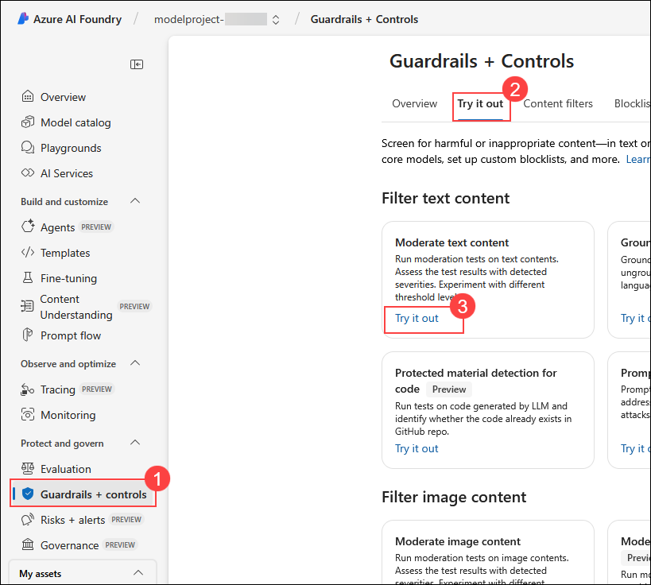

1. On the **Moderate text content** page, select **Run a simple test (1)** and choose **Safe content (2)** under **select a sample or type your own** section.

   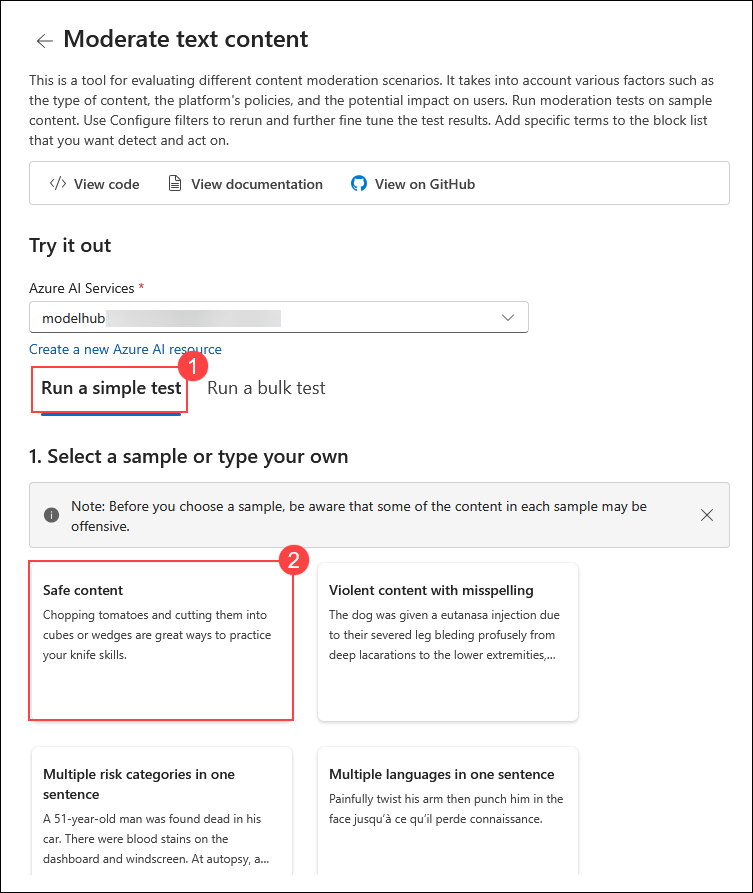

1. In the **Test box**, enter the following:

     - **I recently used the PowerBurner Camping Stove on my camping trip, and I must say, it was fantastic! It was easy to use, and the heat control was impressive. Great product! (1)**

     - Set all Threshold levels to **Medium (2)**.

     - Select **Run test (3)**.

       
     
1. Review the result.

    

    >**Note**: The content is **Allowed**, and the severity level is Safe across all categories. This was to be expected given the positive and unharmful sentiment of the customer’s feedback.


#### Harmful content

But what would happen if we tested a harmful statement? Let’s test with negative customer feedback. While it's OK to dislike a product, we don't want to condone any name calling or degrading statements.

1. In the **Test box**, enter the following:

    - **I recently bought a tent, and I have to say, I'm really disappointed. The tent poles seem flimsy, and the zippers are constantly getting stuck. It's not what I expected from a high-end tent. You all suck and are a sorry excuse for a brand**. **(1)**

    - Set all Threshold levels to **Medium (2)**.

    - Select **Run test (3)**.

      
 
   - Although the content is **Allowed**, the Severity level for **Hate is low**. To guide our model to block such content, we’d need to adjust the Threshold level for **Hate**. A lower Threshold level would block any content that’s a low, medium, or high severity. There’s no room for exceptions!

         

   - Set the Threshold level for **Hate to `Low` (1)**.

   - Select **Run test (2)**.

     
    
   - The content is now **Blocked** and was rejected by the filter in the Hate category.

      

#### Violent content with misspelling

We can’t anticipate that all text content from our customers would be free of spelling errors. Fortunately, the Moderate text content tool can detect harmful content even if the content has spelling errors. Let’s test this capability on additional customer feedback about an incident with a racoon.

1. Select **Violent content with misspelling**.

    

1. In the **Test box**, enter the following:

    - **I recently purchased a campin cooker, but we had an accident. A racon got inside, was shocked, and died. Its blood is all over the interior. How do I clean the cooker? (1)**

    - Set all Threshold levels to **Medium (2)**.

    - Select **Run test (3)**

          

    - Although the content is Allowed, the Severity level for **Violence should be Low**. You could adjust the Threshold level for Violence to try and block such content, however, should we? Consider a scenario where the customer is asking this question in a conversation with the AI-powered customer support agent in hopes of receiving guidance on how to clean the cooker. There may be no ill-intent in submitting this question and therefore, it may be a better choice not to block such content. As the developer, consider various scenarios where such content may be OK before deciding to adjust the filter and block similar content.

     
#### Run a bulk test
So far, we’ve tested image content for singular isolated images. However, if we have a bulk dataset of image content, we could test the bulk dataset at once and receive metrics 
based on the model’s performance.

We have a bulk dataset of images provided by customers. The dataset also includes sample harmful images to test the model’s ability to detect harmful content. Each record in the 
dataset includes a label to indicate whether the content is harmful. Let’s do another test round but this time with the data set!

1. Switch to the **Run a bulk test (1)** tab. Select **Browse for a file (2)**.

    

1. Within **file explorer** navigate to `C:\LabFiles\Developing-AI-Applications-with-Azure-AI-Studio\Labs\data` **(1)** press **Enter**. Select **bulk-text-moderation-dataset.csv (2)** file and **Open (3)**.
   
    > Note: The name of the CSV file may vary.
   
     
     
1. In the **Dataset preview section (1)**, browse through the Records and their corresponding Label. A 0 indicates that the content is acceptable (not harmful). A 1 indicates that the content is unacceptable (harmful content). **(2)**

     - Set all Threshold levels to **Medium (3)**.

     - Select **Run test (4)**.
   
       

1. Review the result.

    

    

### **Review**

Throughout this comprehensive lab series, you gained hands-on experience with Azure AI tools, focusing on Prompt Flow development, evaluation, optimization, and content safety.

You began by understanding the **Flow Development Lifecycle**, followed by initializing Prompt Flow projects and crafting customized prompts. You then developed and enhanced flows using Large Language Models (LLMs) and prompt tools.

As you progressed, you implemented **manual and automated evaluation methods** using built-in metrics, enabling you to assess flow quality and effectiveness. You also performed **iterative prompt tuning and variant comparison**, optimizing flows for production readiness.

Further, you designed and implemented **chat flows**, leveraging LLMs and prompt tools to create dynamic, intelligent interactions. Finally, you explored **Azure AI Content Safety** by testing and analyzing image and text content for potential safety risks, gaining insights into creating more secure and compliant digital environments.

**In summary, you accomplished the following:**

* Comprehended the Flow Development Lifecycle
* Initialized Prompt Flow projects and customized prompts
* Developed flows using LLMs and prompt tools
* Set up manual and automated evaluation methods
* Performed iterative prompt tuning and compared variants
* Optimized flows for production deployment
* Designed and implemented chat flows
* Evaluated image and text content for safety using Azure AI Content Safety

These labs provided a robust foundation in designing, evaluating, and deploying AI-powered flows while ensuring responsible content moderation and enhanced user experience.


### You have successfully completed the lab.
