# Lab 03: Evaluation Flow Setup

#### Estimated Duration: 90 Minutes

## Overview

In this lab, you will set up an automated evaluation pipeline using built-in evaluation metrics and configure manual evaluation for deeper insights. You will begin by leveraging built-in metrics such as accuracy, precision, recall, and F1 score to assess model performance automatically. Then, you will set up a manual evaluation process where human reviewers can provide qualitative feedback on model outputs. This hands-on lab will help you understand the integration of automated and manual evaluation methods to improve model accuracy and reliability.

## Objectives

In this lab, you will perform the following:
- Task 1: Setup Manual Evaluation
- Task 2: Set up Automated Evaluation with Built-in Evaluation Metrics

### Task 1: Setup Manual Evaluation

In this task, you will set up a manual evaluation process to assess model performance. This involves defining evaluation criteria, collecting human feedback, and analyzing results to measure accuracy and identify potential biases. 

1. From the left navigation menu, under the **Protect and govern** section, select **Evaluation (1)**. On the **Assess and compare AI application performance** select the **Manual evaluations (2)** tab. Select **+ New manual evaluation (3)**.

   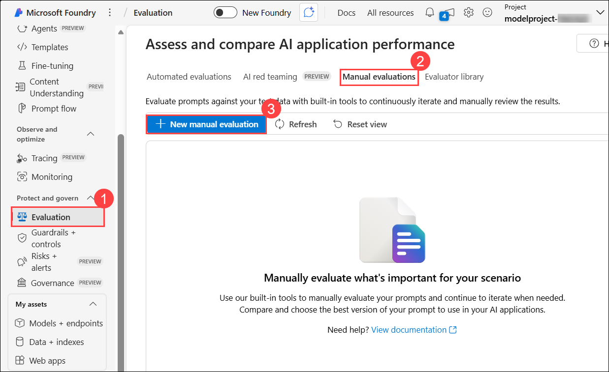

1. A new window opens with your **System message (1)** already populated and your deployed **Model (2)** already selected.

   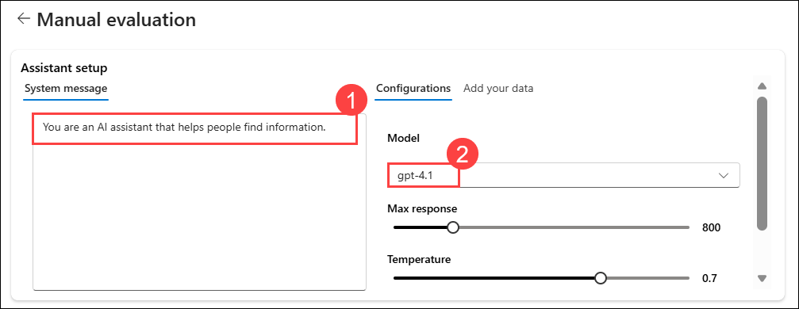

1. In the **Manual evaluation result** section, you'll add five inputs for which you will review the output. Enter the following five questions as five separate inputs by selecting **+ Add input**:

   `Can you provide a list of the top-rated budget hotels in Rome?`

   `I'm looking for a vegan-friendly restaurant in New York City. Can you help?`

   `Can you suggest a 7-day itinerary for a family vacation in Orlando, Florida?`

   `Can you help me plan a surprise honeymoon trip to the Maldives?`

   `Are there any guided tours available for the Great Wall of China?`

   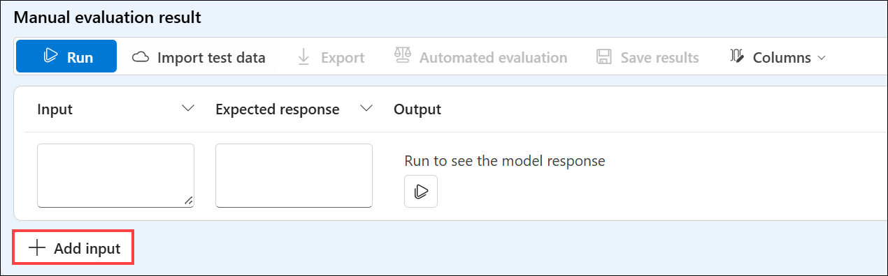

1. Select **Run** from the top bar to generate outputs for all questions you added as inputs.

    

1. You can now manually review the **Outputs** for each question by selecting the thumbs-up or down icon at the bottom right of a response. Rate each response, ensuring you include at least one thumbs-up and one thumbs-down response in your ratings.

   

   > **Note:** If you receive an error in any of the outputs while executing the run, "exceeded token rate limit of your current AIService", then please rerun the failed ones after a couple of minutes.

1. Select **Save results (1)** from the top bar. Enter **manual_evaluation_results (2)** as the name for the results, and select **Save (3)**.

   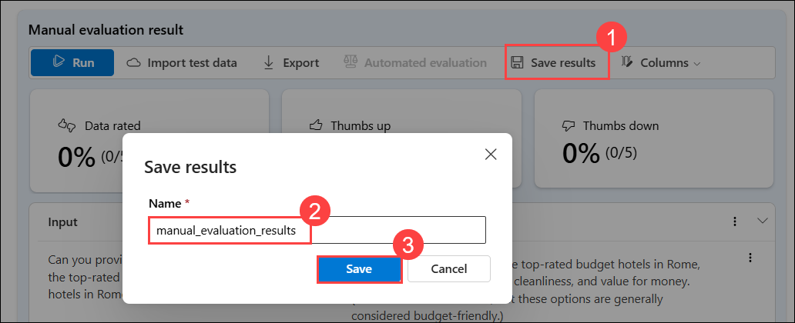
   
1. From the left-hand menu, navigate to **Evaluations (1)** under the **Protect and govern** section. Select the **Manual evaluations (2)** tab to find the manual evaluations you just saved, **manual_evaluation_results (3)**. Note that you can explore your previously created manual evaluations, continue where you left off, and save the updated evaluations.

   

### Task 2: Setup Automated Evaluation with Built-in Evaluation Metrics

In this task, you will configure automated evaluation using built-in metrics to measure model performance quickly and accurately.

1. From the left navigation menu, under the **Protect and govern** section, select **Evaluation (1)**. On the **Assess and compare AI application performance** select **Automated evaluations (2)** tab. Select **Create a new evaluation (3)**.

   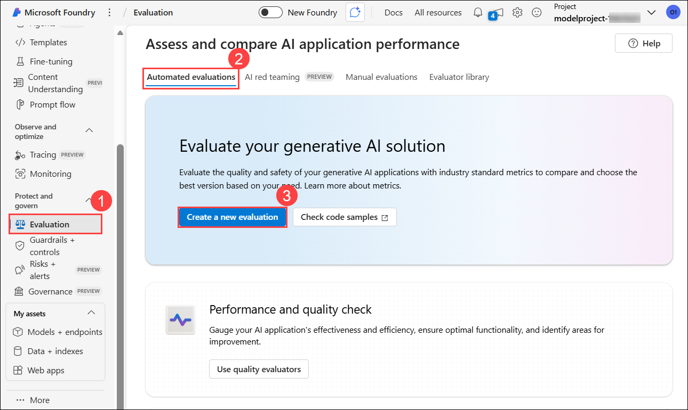

1. On the **Create a new evaluation** pane, select **Evaluate an existing query-response dataset (1)** and click on **Next (2)**.

   

1. Open a new tab and paste the new link **https://raw.githubusercontent.com/MicrosoftLearning/mslearn-ai-studio/main/data/travel-qa.jsonl** JSONL file. press **Ctrl+A** and **Ctrl+C** to select all and **Copy**.
  
    - Search for **Visual Studio Code (1)** in the Windows search bar of the vm and select **Visual Studio Code (2)**.

       

    - From the **File (1)** menu, select **New Text File (2)**, 

       

    - **Paste the copied code [Ctrl+V]**.

    - Navigate to **File (1)** and click on **Save As (2)**.    

           

    - Click on **Desktop (1)**, Enter the File name as **Sample (1)** select **JSON Lines (3)** for Save as type and then click on **Save (4)**.

       

      > **Note:** Make sure to select the correct file type. The AI Foundry portal only accepts files in the **JSON Lines** format. If any other file type is selected, the file will not be accepted.

1. Navigate back to **Microsoft Foundry**, where your **creating a new evaluation**.
   
    - **Configure test data**: select **Upload new dataset**
  
         

    - Navigate to **Desktop (1)**, select the file **Sample.jsonl** **(2)** and Click on **Open** **(3)**.

         

    - Select **Next** 

    - **Configure Evaluators**: Click on **+ Add** and select **Likert-scale evaluator**

      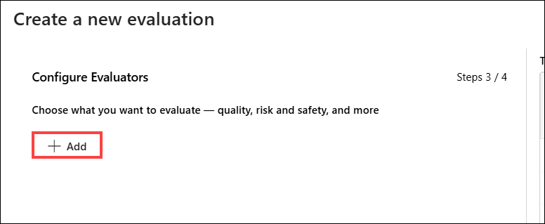
      
      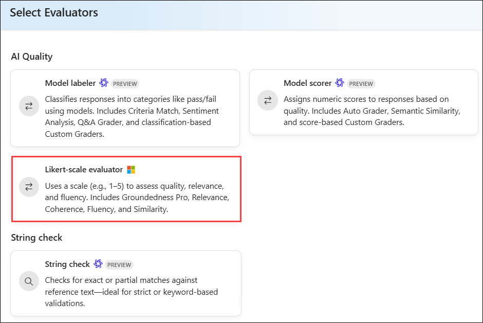
      
    - Enter **Coherence (1)** in the Criteria name field, then click on the **Coherence (2)** preset. In the **Query (3)** field, select `{{item.query}}`, and in the **Response (4)** field, select `{{item.response}}`. Finally, click **Add (5)** to save the configuration.  

      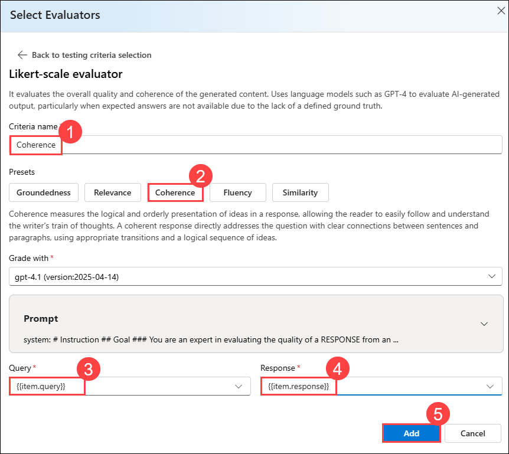

    - **Configure Evaluators**: Click on **+ Add** and select **Likert-scale evaluator**

      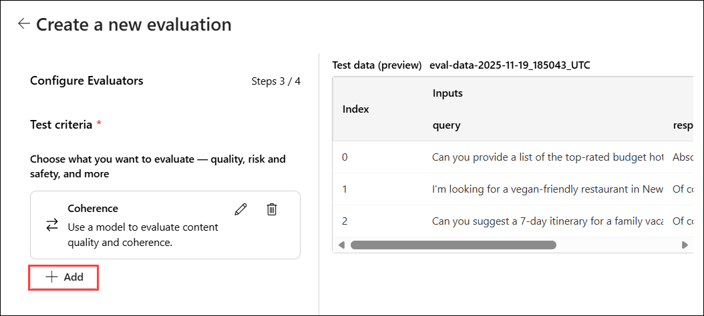
      
      

    - Enter **Fluency (1)** in the Criteria name field, then click on the **Fluency (2)** preset. In the **Query (3)** field, select `{{item.query}}`, and in the **Response (4)** field, select `{{item.response}}`. Finally, click **Add (5)** to save the configuration.  

      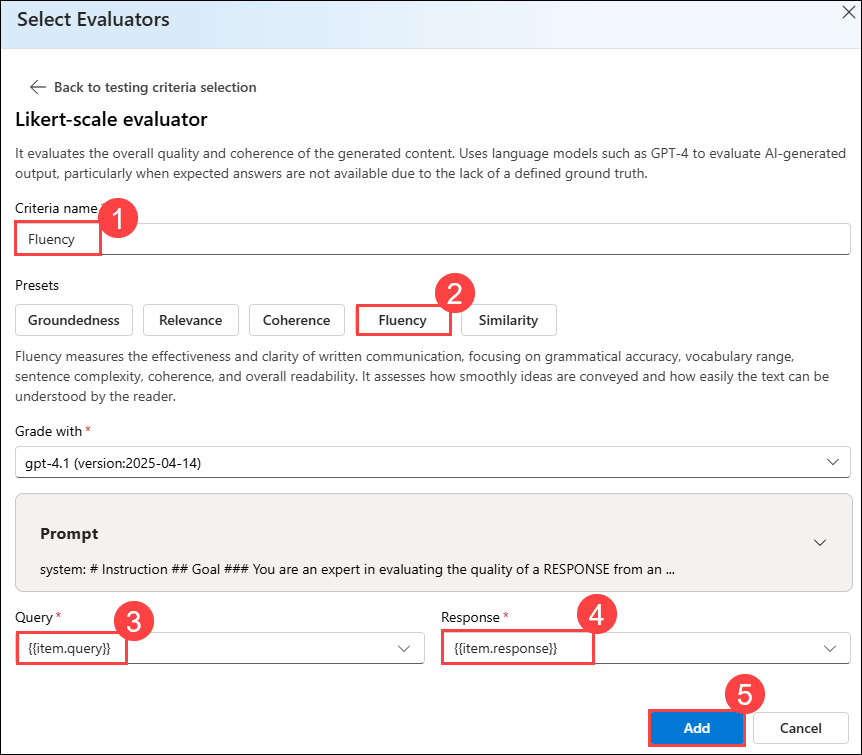
    
    - Once added, click on **Next**.

      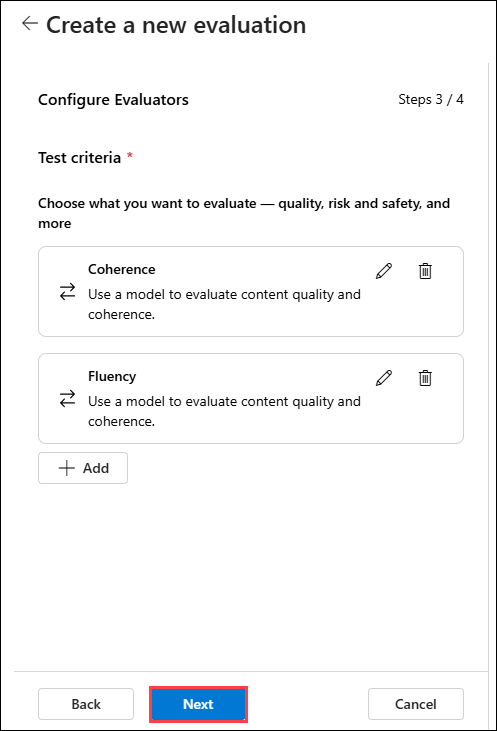

   - Now, update model Evaluation name to  **Modelevaluation-<inject key="DeploymentID" enableCopy="false"/> (1)** and click on **Submit (2)**.
     
     
     
1. Wait until the evaluation status changes to **Completed**. If the status shows **Queued** or **Running**, you may need to refresh the page to see the latest update.

   

1. From the left navigation menu, under the **Protect and govern** section, select **Evaluation (1)**, and under **Automated evaluation (2)**, choose the newly created evaluation run **(3)**.

   

1. Under the **Report** tab, scroll down to explore the **Metric dashboard**.

    

1. Navigate to **Data (1)** tab from the top menu to view the **Detailed metrics results (2)**.    

    

## Summary

In this lab, you have completed the following tasks:
- Set Up Manual Evaluation
- Set up Automated Evaluation with Built-in Evaluation Metrics

### You have successfully completed the lab. Click on **Next >>** to proceed with the next Lab.

