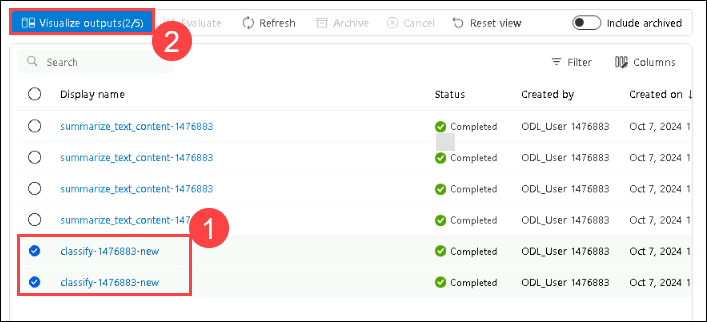
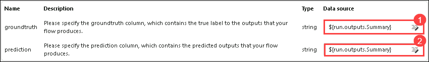

# Lab 04: Fine-Tuning the Model 

## Lab scenario
In this lab, you will be fine-tuning a model by performing iterative prompt tuning and variant comparison to enhance its performance and accuracy. You will leverage Azure AI Studio to systematically refine prompts, evaluate different model variants, and determine the best configurations. Additionally, you will optimize the flow performance for production, ensuring that the workflow processes are efficient and effective. This will involve identifying and addressing bottlenecks, implementing best practices, and leveraging advanced tools to improve overall productivity and operational efficiency.

## Lab objectives
In this lab, you will perform the following:
- Task 1: Perform Iterative Prompt Tuning and Variant Comparison
- Task 2: Optimize Flow Performance for Production

## Task 1: Perform Iterative Prompt Tuning and Variant Comparison 
It refine model responses by adjusting prompts in successive iterations. This process allows for systematic evaluation of the differences between output variants, ensuring that the model's performance improves with each iteration and produces the most accurate and relevant responses.

1. On the [Azure AI foundry](https://ai.azure.com/?reloadCount=1), under **Tools** section select **Prompt flow (1)**. Select **+ Create (2)** to open the flow creation wizard.

   

1. In the **Create a new flow** under **Explore gallery** in the **Web Classification** box select **Clone**.

     

1. On the **Clone Flow** page, enter name **Web Classification-<inject key="DeploymentID" enableCopy="false"/> (1)** and click on **Clone (2)**.

      

1. Scroll down to **classify_with_llm** node and Select the following:

    - Connection : Select the connection **ai-modelhub<inject key="DeploymentID" enableCopy="false"/>xxxxxxxx_aoai** (1)

    - deployment_name : **gpt-4** (2)

      
   
1. Replace the existing prompt with the following prompt as a baseline prompt in the classify_with_llm node.

   ```
   # system:
   Your task is to classify a given URL into one of the following types:
   Movie, App, Academic, Channel, Profile, PDF, or None based on the text content information.
   The classification will be based on the URL, the webpage text content summary, or both.

   # user:
   For a given URL: https://www.youtube.com/channel/UC_x5XG1OV2P6uZZ5FSM9Ttw, and text content: NFL Sunday Ticket is a service offered by Google LLC that allows users to watch NFL games 
   on YouTube. It is available in 2023 and is subject to the terms and privacy policy of Google LLC. It is also subject to YouTube's terms of use and any applicable laws.
   Classify the above URL to complete the category and indicate evidence.
   
   ```

1. Select **Show variants** button on the top right of the LLM node. The existing LLM node is variant_0 and is the default variant.

      

1. Select the **Clone** button on variant_0 to generate variant_1, then we can configure parameters to different values on variant_1

     
   
1. On the variant_1 replace the existing prompt with the following prompt:

    ```  
    # system:  
    Your task is to classify a given URL into one of the following types:
    Movie, App, Academic, Channel, Profile, PDF, or None based on the text content information.
    The classification will be based on the URL, the webpage text content summary, or both.

    # user:
    For a given URL: https://play.google.com/store/apps/details?id=com.spotify.music, and text content: Spotify is a free music and podcast streaming app with millions of songs, albums, 
    and original podcasts. It also offers audiobooks, so users can enjoy thousands of stories. It has a variety of features such as creating and sharing music playlists, discovering new 
    music, and listening to popular and exclusive podcasts. It also has a Premium subscription option which allows users to download and listen offline, and access ad-free music. It is 
    available on all devices and has a variety of genres and artists to choose from.
    Classify the above URL to complete the category and indicate evidence.

    ```

    
     
1. Select **Hide variants** to stop adding more variants. All variants are folded. The default variant is shown for the node. For classify_with_llm node, based on variant_0:

1. Scroll up to **summarize_text_content** node and Select the following 

   - Connection : Select the connection **ai-modelhub<inject key="DeploymentID" enableCopy="false"/>xxxxxxxx_aoai**

   - deployment_name : **gpt-4**

1. Replace the existing prompt with the following prompt as a baseline prompt in summarize_text_content node, based on variant_0, you can create variant_1.  
     
   ```  
   # system:
   Please summarize the following text in one paragraph. 100 words.
   Do not add any information that is not in the text.

   # user:
   Text: The history of the internet dates back to the early 1960s, when the idea of a global network of computers was first proposed. In the late 1960s, the Advanced Research Projects 
   Agency Network (ARPANET) was developed by the United States Department of Defense. It was the first operational packet-switching network and the precursor to the modern internet. The 
   1970s and 1980s saw the development of various protocols and standards, such as TCP/IP, which allowed different networks to communicate with each other. In the 1990s, the invention 
   of the World Wide Web by Tim Berners-Lee revolutionized the internet, making it accessible to the general public. Since then, the internet has grown exponentially, becoming an 
   integral part of daily life for billions of people around the world.

   assistant:
   Summary:
   ```

1. Select **Show variants** button on the top right of the LLM node. The existing LLM node is variant_0 and is the default variant.

    
   
1. Select the **Clone** button on variant_0 to generate variant_1, then we can configure parameters to different values on variant_1

1. On the variant_1 replace the existing prompt with the following prompt:

   ```
   # system:
   Please summarize the following text in one paragraph. 100 words.
   Do not add any information that is not in the text.

   # user:
   Text: Artificial intelligence (AI) refers to the simulation of human intelligence in machines that are programmed to think and learn. AI has various applications in today's society, 
   including robotics, natural language processing, and decision-making systems. AI can be categorized into narrow AI, which is designed for specific tasks, and general AI, which can 
   perform any intellectual task that a human can. Despite its benefits, AI also poses ethical concerns, such as privacy invasion and job displacement.

   assistant:
   Summary:

   ```
1. Click the **Save** button from the top menu, then select **Start Compute Session**. Run all the nodes by clicking the play button on each existing node. Finally, click the **Run** button in the top right corner.

    

1. On the Submit flow run window open under **Select the LLM node with variants that you want to run** choose **Select a node to run variants** then select **summarize_text_content (1)**, and click on **Submit (2)**. 

   
   
1. Once the session runs successfully, review the output by selecting each variant.

1. In top menu select **Variant 0 (1)** from the drop down and select **view full output** for **summarize_text_content** for **variant 0**. Now, review the output of the variant, that you selected.

   

   

## Task 2: Optimize Flow Performance for Production 
It involves analyzing and refining workflow processes to ensure maximum efficiency and minimal downtime. This includes identifying bottlenecks, implementing best practices, and utilizing advanced tools and technologies to streamline operations. Continuous monitoring and iterative improvements are essential to maintain high performance and adapt to changing production demands, ultimately leading to increased productivity and reduced operational costs.

1. Under **Inputs**, click on **+ Add input** then add **category** and **text-context**. Under **Output**, click on **+ Add output** then add **category** and **evidence**. Click on **Save**.

    

   >**Note:** In the Output section, if the outputs are already added, please ignore and select **Save**.
   
1. Select **Evaluate (1)** > **Custom Evaluation (2)**.

   

1. On the **Batch run & Evaluate** give **Run display name** as **classify-<inject key="DeploymentID" enableCopy="false"/> (1)**, then under **Variants** select **classify_with_llm (2)**, and click on **Next (3)**.

   

1. On the Batch run settings select **+ Add new data**.

1. On the **Add new data** window open enter name  **classify_with_llm_data_set (1)** select **Upload from local file** and click on browser then select **classify.jsonl (2)** file from **C:\LabFiles\Model-Evaluation-and-Model-Tunning\Labs\data** and click on **Add (3)**.

     

1.  Select **${data.text-context} (1)** for text-context and select **Next (2)**.

     
   
1. On the **Select evaluation** page, select **Classification Accuarancy Evaluation (1)** and click on **Next (2)**.

   

1. On **Configure evaluation** page expand **Classification Accuarancy Evaluation** and for **groundtruth** data source enter **${data.url}** and **prediction** select **category**, and select **Next**.

     

1. On **Review** page review the settings and click on **Submit**

1. Back on Prompt flow page and from top click on **View run list** link.

    
   
1. After the batch run and evaluation run complete, in the run detail page, multi-select the batch runs for each variant, then select Visualize outputs. You will be able to see the metrics of 2 variants for the classify_with_llm node and LLM, along with predicted outputs for each recorded data.

   

1. After you identify which variant is the best, you can go back to the flow authoring page and set that variant as default variant of the node

1. Now will evaluate the variants of summarize_text_content node as well.

1. Back on **Prompt flow** page, under **Input** section apart from **url** remove the rest input and click on **+ Add input** then enter **Text**. Under outputs delete the existing outputs and click on **+ Add output** then add **Summary**, select the value as **${inputs.Text}**, and add **url** select the value as **${inputs.url}**.

   

1. Click on **Save**.

1. Select **Evaluate (1)** and then select **Custom Evaluation (2)**.

   

1. On the Batch run & Evaluate give **Run display name** as **summarize_text_content-<inject key="DeploymentID" enableCopy="false"/> (1)**, then under variants select **Use default variants for all nodes (2)**, and select **summarize_text_content (3)** click on **Next (4)**.

   

1. On the Batch run settings, click on **+ Add new data**.

1. In the new data window, enter name  **summarize_text_content_data_set** select **Upload from local file** and click on browser then select **summarize.jsonl** file from **C:\LabFiles\Model-Evaluation-and-Model-Tunning\Labs\data** and click on **Add**.

1. Under **Input mapping** for **url** select **${data.text} (1)**, and for **text** select **${data.text} (2)**. Select **Next (3)**.

   

1. On the **Select evaluation** page select **Classification Accuarancy Evaluation (1)** and click on **Next (2)**.

   

1. On **Configure evaluation** page expand **Classification Accuarancy Evaluation** and make sure for **groundtruth** data source is select as **${data.url} (1)** and **prediction** as **${data.category} (2)** and click on **Review + submit (3)**.

    

1. On **Review** page review the settings and click on **Submit**.

    .png)

1. Back on Prompt flow page and from top click on **View run list** link.

   
   
1. After the batch run and evaluation run complete, in the run detail page, **multi-select (1)** the batch runs for each variant, then select **Visualize outputs (2)**. You will see the metrics of 2 variants for the classify_with_llm node and LLM predicted outputs for each record of data.

   

1. After you identify which variant is the best, you can go back to the flow authoring page and set that variant as default variant of the node

## Review
In this lab you have completed the following tasks:
- Performed Iterative Prompt Tuning and Variant Comparison 
- Optimized Flow Performance for Production

### You have successfully completed the lab. Click on **Next >>** to procced with next exercise.
