# Lab 05: Implementing Chat Flow and Tool Integration

## Estimated Duration: 60 Minutes

## Lab Overview
In this lab, you will be designing and implementing a chat flow to interact with a deployed language model. You'll start by creating a basic chat flow using Azure AI foundry, which includes integrating inputs, an LLM node, and configuring the output to reflect chat responses. You will then test the chat flow, ensure it functions correctly, and deploy it to a production environment. The final steps involve verifying the deployment, testing the deployed flow with sample queries, and exploring options for integrating the chat flow into applications as a custom copilot.

## Lab Objectives

In this lab, you will perform the following:
- Task 1: Design and Implement a Chat Flow
- Task 2: Use LLM and Prompt Tools in Flows

## Task 1: Design and Implement a Chat Flow

In this task, you will design and implement a chat flow using Azure AI Foundry to interact with a deployed language model. You will test its functionality to ensure accurate and relevant responses and prepare the chat flow for deployment in a production environment.

1. From the left navigation menu, under **My assets**, select **Model + endpoints (1)**.

1. On the **Manage deployments of your models, apps, and services**, under **Model deployments** tab, select **+ Deploy model (2)** and then select **Deploy base model (3)** from the dropdown.

   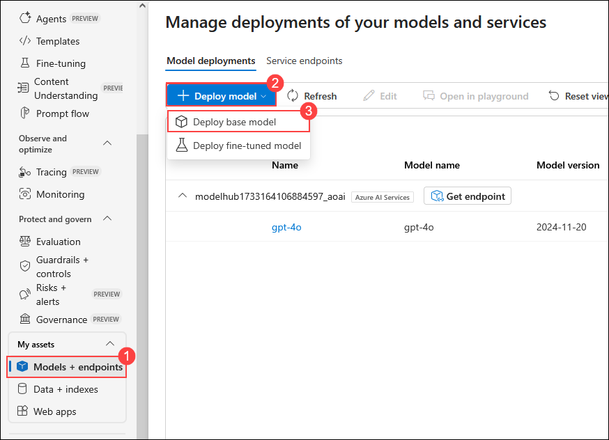

1. On the **Select a model** page, search for **gpt-35-turbo (1)**, select **gpt-35-turbo (2)**, select **Confirm (3)** under the **gpt-35-turbo**.

   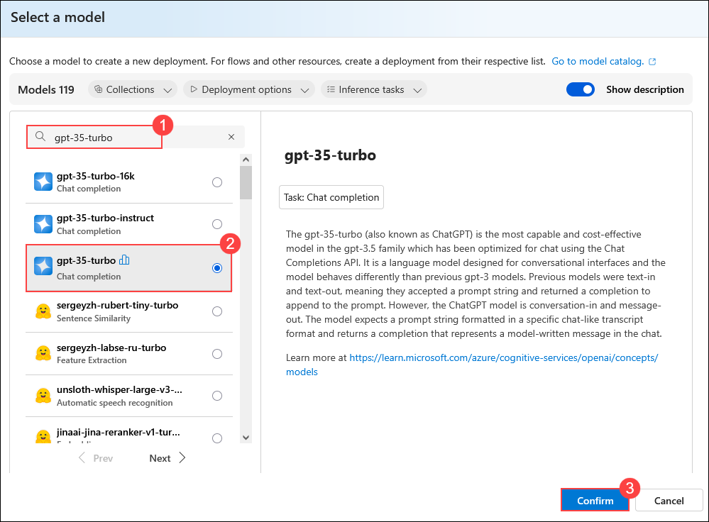

1. On **Deploy model gpt-35-turbo**, click on **Customize**.

   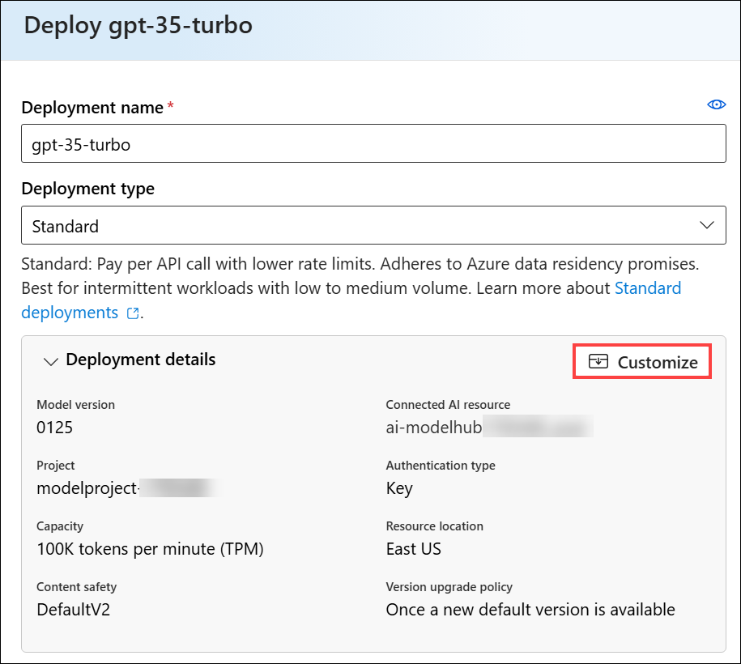

1. On **Deploy model gpt-35-turbo** follow these instructions to create the deployment:
   
   - Deployment Name : **gpt-35-turbo (1)**
   - Deployment type: **Standard (2)**
   - Model version: **0125 (Default) (3)**
   - Connected AI resource: select the resource that we created in an earlier task **(4)**
   - Tokens per Minute Rate Limit: **10K (5)**
   - Content Filter: **DefaultV2 (6)**
   - Enable dynamic quota: **Enabled (7)**
   - Select **Deploy (8)**

     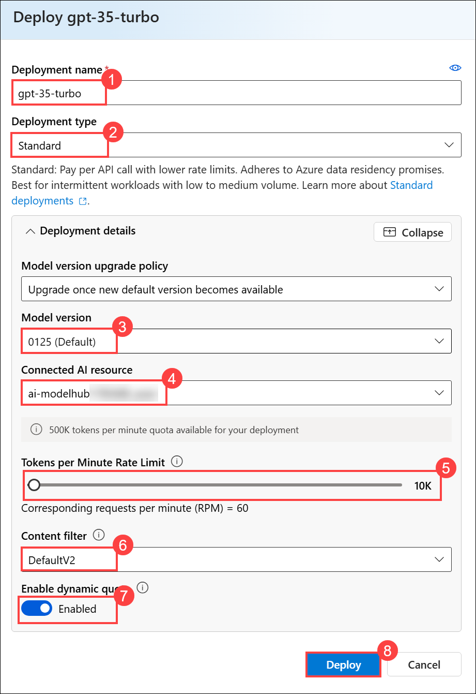
     
1. On the [Azure AI foundry](https://ai.azure.com/?tid=f9733b59-6ed1-4cb1-a5c4-55f5c0d6ad6f), under **My assets**, select **Model + endpoints (1)**. On the **Model + deployments** page select **gpt-35-turbo (2)** then click **Open in playground (3)**

    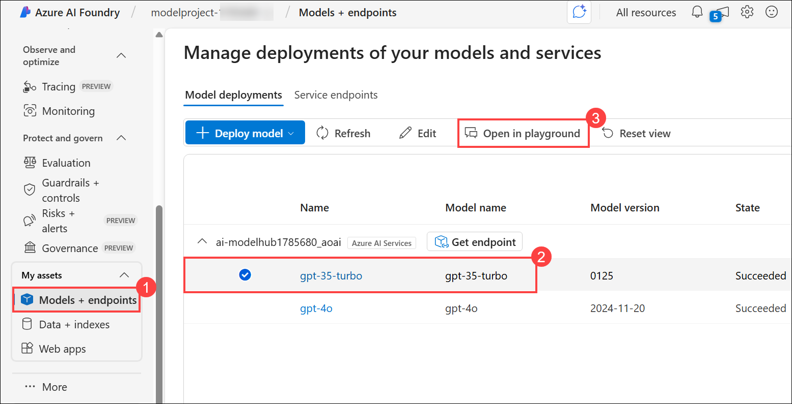

1. In the chat window, enter the query **What can you do?**.

   >**Note:** The answer is generic because there are no specific instructions for the assistant. To make it focused on a task, you can change the system prompt.
   > Wait for 2-3 mins if you get an error while querying.
   
     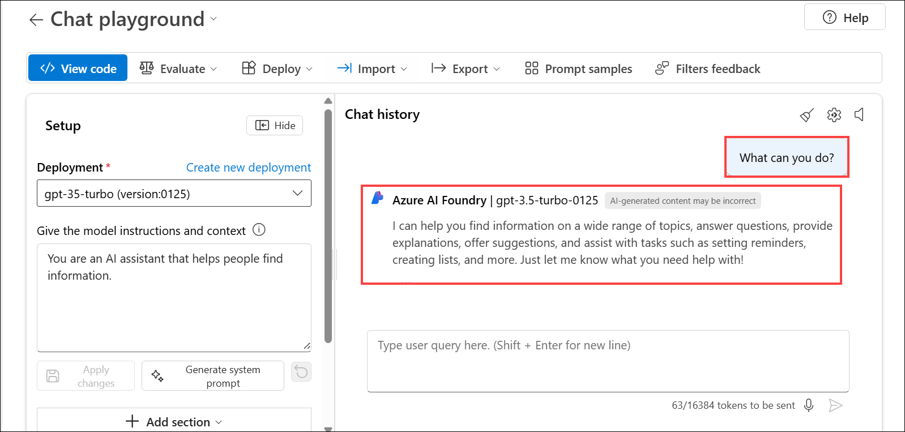

   >**Note:** The output will be different; it will not be the same. However, it will look similar to the screenshot.

1. Update the **Give the model instructions and context (1)** to the following:-

   ```
   **Objective**: Assist users with travel-related inquiries, offering tips, advice, and recommendations as a knowledgeable travel agent.

   **Capabilities**:
   - Provide up-to-date travel information, including destinations, accommodations, transportation, and local attractions.
   - Offer personalized travel suggestions based on user preferences, budget, and travel dates.
   - Share tips on packing, safety, and navigating travel disruptions.
   - Help with itinerary planning, including optimal routes and must-see landmarks.
   - Answer common travel questions and provide solutions to potential travel issues.
    
   **Instructions**:
   1. Engage with the user in a friendly and professional manner, as a travel agent would.
   2. Use available resources to provide accurate and relevant travel information.
   3. Tailor responses to the user's specific travel needs and interests.
   4. Ensure recommendations are practical and consider the user's safety and comfort.
   5. Encourage the user to ask follow-up questions for further assistance.

   ```
   
1. Select **Apply changes (2)** and when **Update system message?** pop-up appears, click on **Continue**.

        

1. In the chat window, enter the same query as before: **What can you do?**. Note the change in response.

     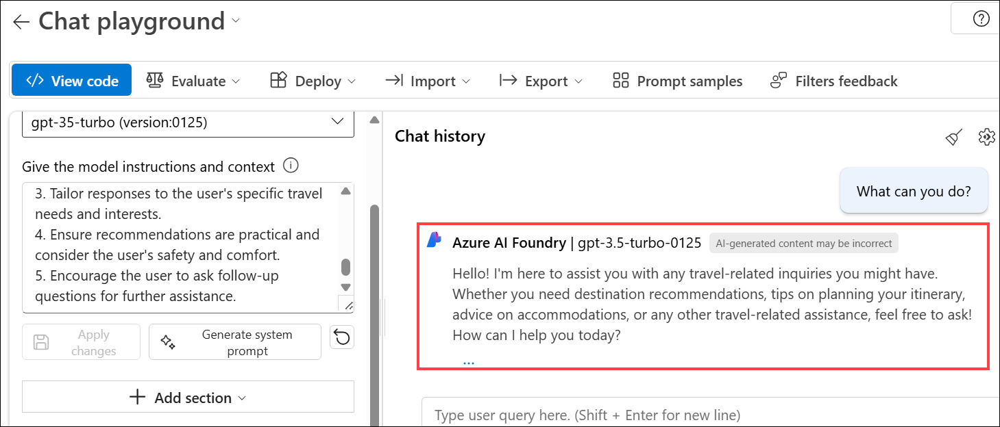

     >**Note:** The output will be different; it will not be the same. However, it will look similar to the screenshot.

1. From the left navigation pane, select **Prompt flow (1) > + Create (2)** to add the Prompt tool to your flow.

   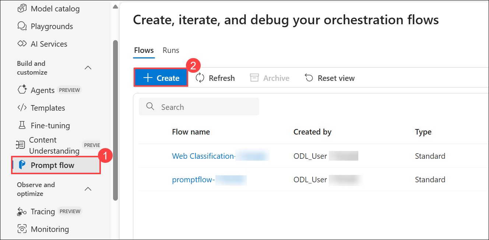

1. On **Create a new flow** blade, under **Chat flow**, click on **Create (1)**, then enter **Travel-Chat (2)** for Folder name, then click on **Create (3)** 

   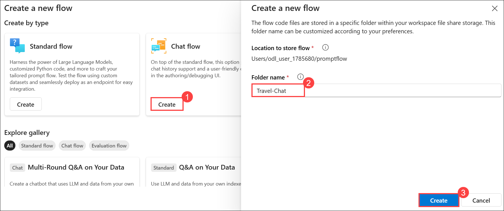

1. A simple chat flow is created for you. Note there are two inputs (**chat history and the user’s question**) **(1)**, an LLM node that will connect with your deployed language model, and an output to reflect the response in the chat **(2)**.

   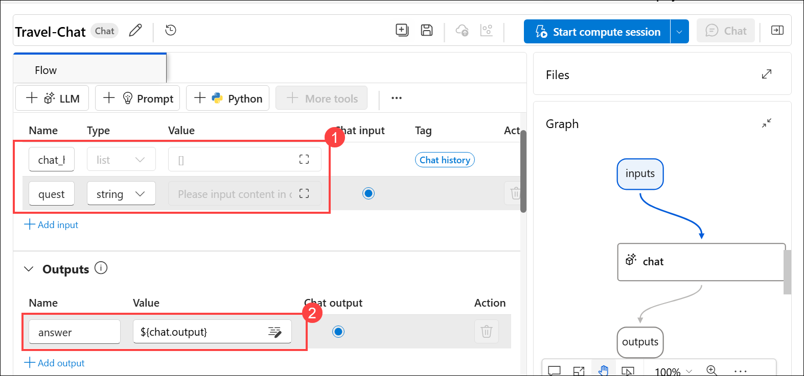

1. To be able to test your flow, you need compute. Select **Start compute session** from the top bar.

   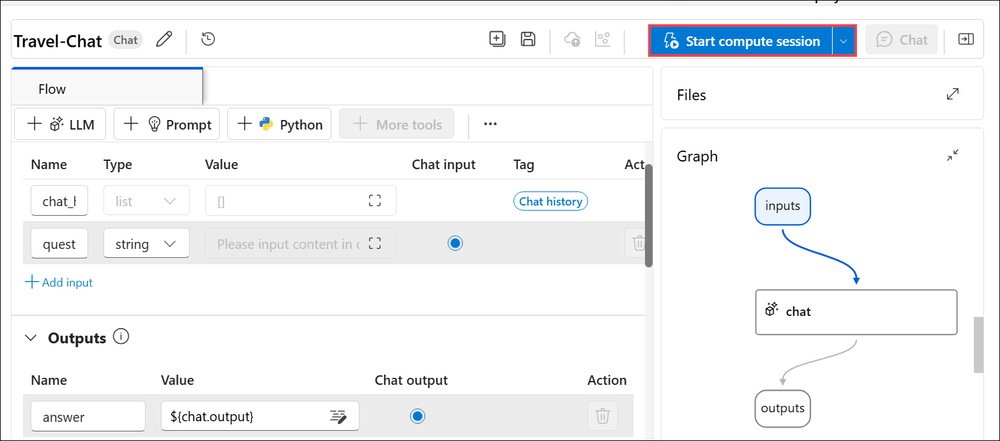
   
   >**Note:** The compute session will take 1-3 minutes to start.
   
1. Select the LLM node named **chat (1)**. Update the system message like below **(2)**:

   ```
   system:
   **Objective**: Assist users with travel-related inquiries, offering tips, advice, and recommendations as a knowledgeable travel agent.
   
   **Capabilities**:
   - Provide up-to-date travel information, including destinations, accommodations, transportation, and local attractions.
   - Offer personalized travel suggestions based on user preferences, budget, and travel dates.
   - Share tips on packing, safety, and navigating travel disruptions.
   - Help with itinerary planning, including optimal routes and must-see landmarks.
   - Answer common travel questions and provide solutions to potential travel issues.
   
   **Instructions**:
   1. Engage with the user in a friendly and professional manner, as a travel agent would.
   2. Use available resources to provide accurate and relevant travel information.
   3. Tailor responses to the user's specific travel needs and interests.
   4. Ensure recommendations are practical and consider the user's safety and comfort.
   5. Encourage the user to ask follow-up questions for further assistance.
   
   
   user:
   {{item.inputs.question}}
   assistant:
   {{item.outputs.answer}}
   
   
   user:
   {{question}}
   ```

   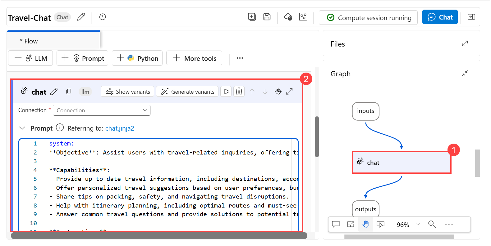

1. Select **Save (3)**.

   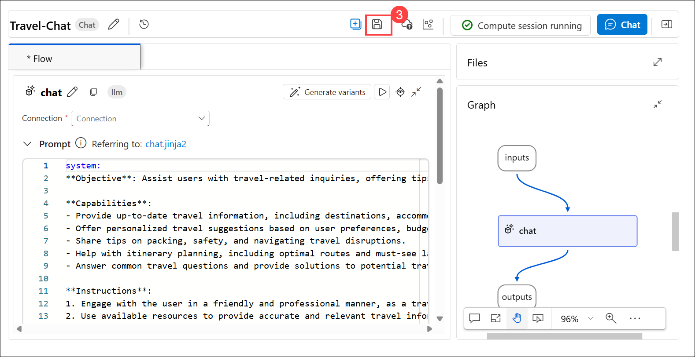

1. You still need to connect the LLM node to your deployed model. At the top of the**LLM node** section, you need to select the connection from the drop-down list and proceed as below.

   - **Connection**: Select the connection that was newly created for you when you created the **gpt-35-turbo** **(1)** deployment. 
   - **Api**: Select **chat (2)**.
   - **deployment_name**: Select the **gpt-35-turbo (3)** model you deployed.
   - **response_format**: Select **{“type”:”text”} (4)**.

     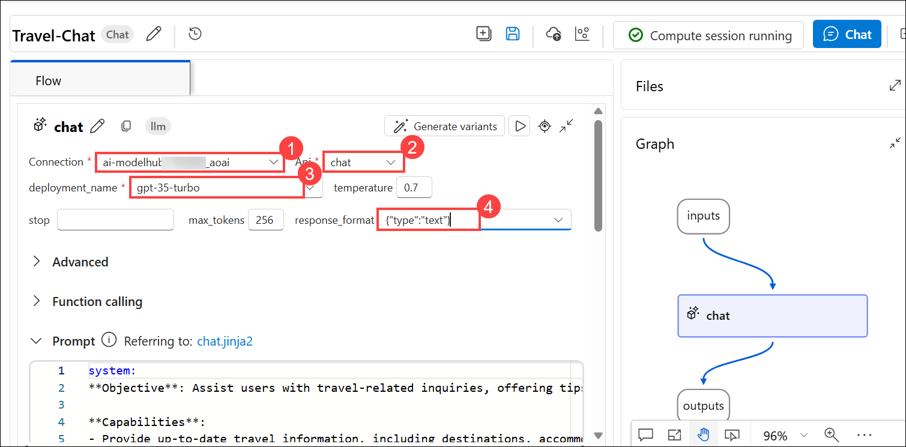
   
## Task 2: Use LLM and Prompt Tools in Flows

In this task, you will use the chat window to test the developed flow by leveraging built-in LLM and prompt tools within Azure AI Foundry. This will help you validate the flow's behavior, experiment with prompt tuning, and ensure the language model responds accurately within the defined interaction patterns.

1. Ensure the compute session is running. Select **Save (1)**. Select **Chat (2)** to test the flow.

   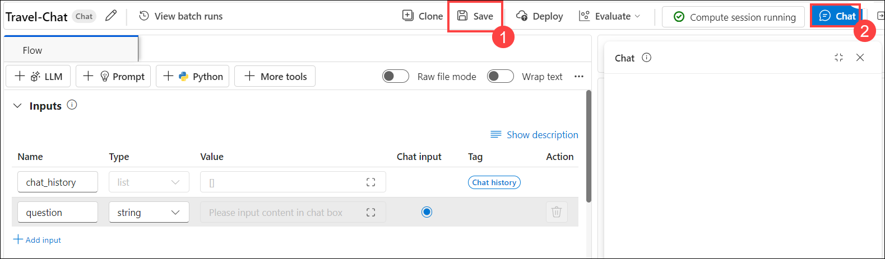

1. Enter the query: **I have one day in London, what should I do?** and review the output.

   

   >**Note:** The output will be different; it will not be the same. However, it will look similar to the screenshot.

1. Select **Deploy** to deploy the flow with the following settings:

   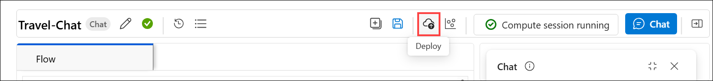
   
   - Basic settings:
     - Endpoint: **New (1)**
     - Endpoint name: **modelendpoint-<inject key="DeploymentID" enableCopy="false"/> (2)**
     - Deployment name: **modeldeploy-<inject key="DeploymentID" enableCopy="false"/> (3)**
     - Virtual machine: **Standard_DS3_v2 (4)**
     - Instance count: **3 (5)**
     - Inferencing data collection: **Enabled (6)**
     - Select **Review + Create (7)**

         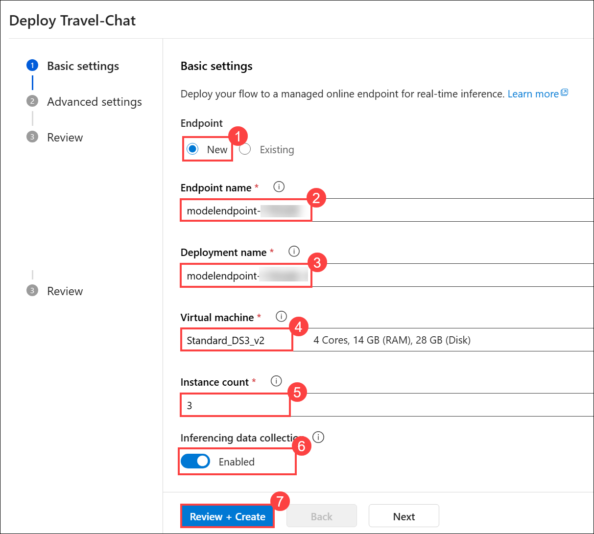

1. Review the configurations and then select **Create**.

   

1. In Azure AI Foundry, from the left navigation pane, under **My assets**, select **Model + endpoints (1)**

   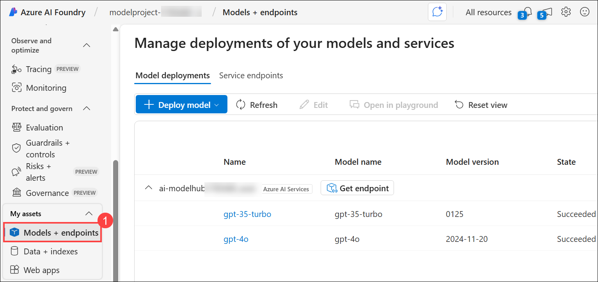

   >**Note:** Select **Save** if your flow is not saved.

1. Select the **Model deployments (2)** tab to find your deployed flow. It may take some time before the deployment is listed and successfully created. When the deployment has succeeded, select the newly created deployment **(3)**.

   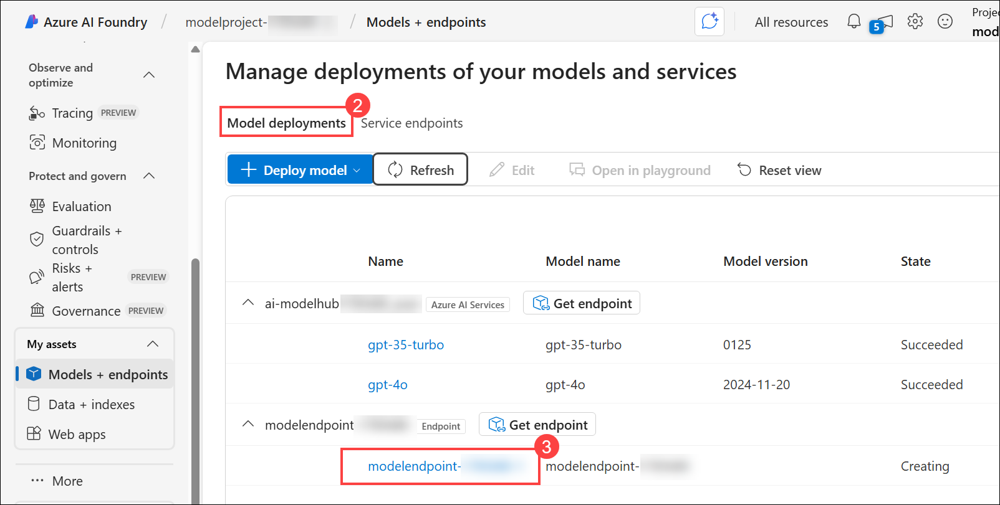

   > **Note:** It might take 3-5 minutes to deploy.

1. Wait untill the **Provisioning state** become **Succeeded (1)**, then only you will get the **Test (2)** tab.

   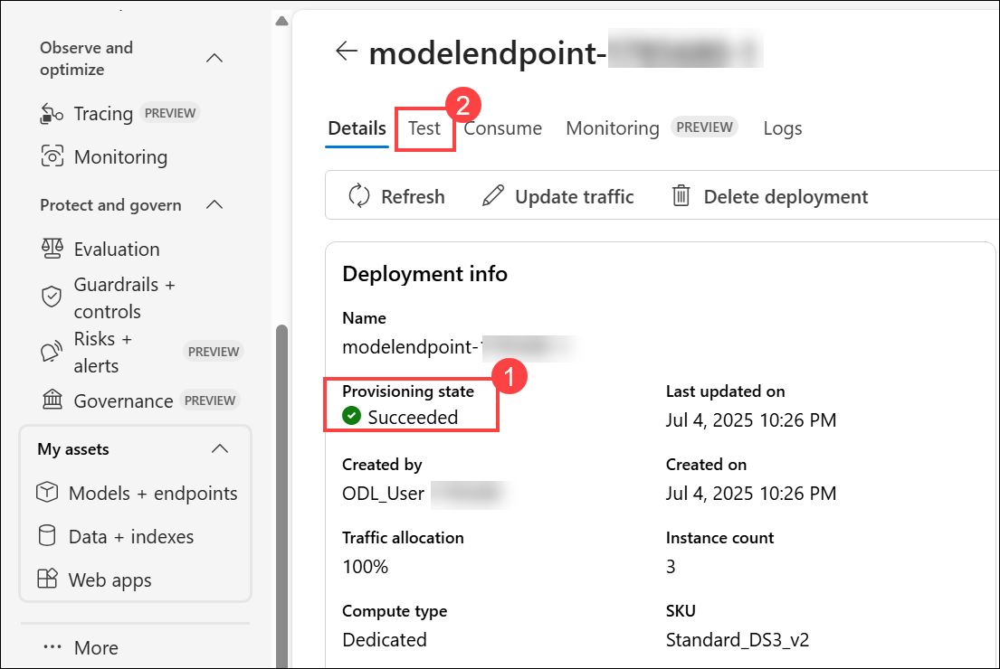

1. Navigate to the **Test** tab, and enter the prompt **What is there to do in San Francisco? (1)** in the input question (string) section, and review the response **(2)**.

     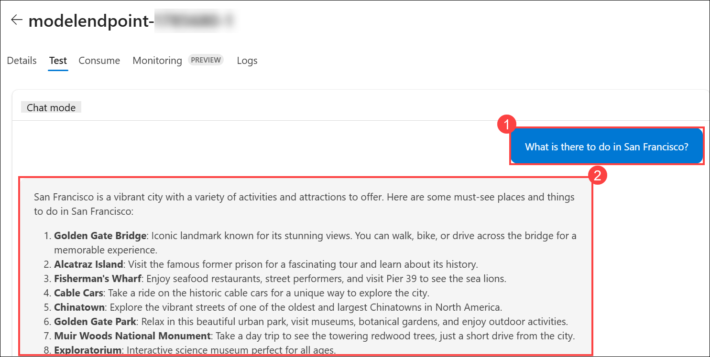

     >**Note:** If the **Test** tab is not opening, wait for 3-5 minutes, refresh the page, and try again. 

     >**Note:** The output will be different; it will not be the same. However, it will look similar to the screenshot.

1. Enter the prompt **Where else could I go?** and review the response.

     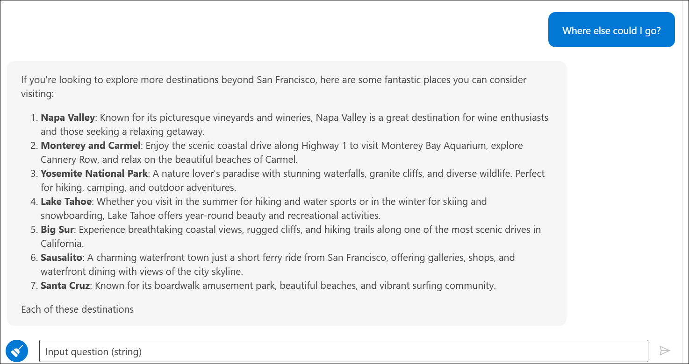

     >**Note:** The output will be different; it will not be the same. However, it will look similar to the screenshot.

1. View the **Consume** page for the endpoint, and note that it contains connection information and sample code that you can use to build a client application for your endpoint - enabling you to integrate the prompt flow solution into an application as a custom copilot.

   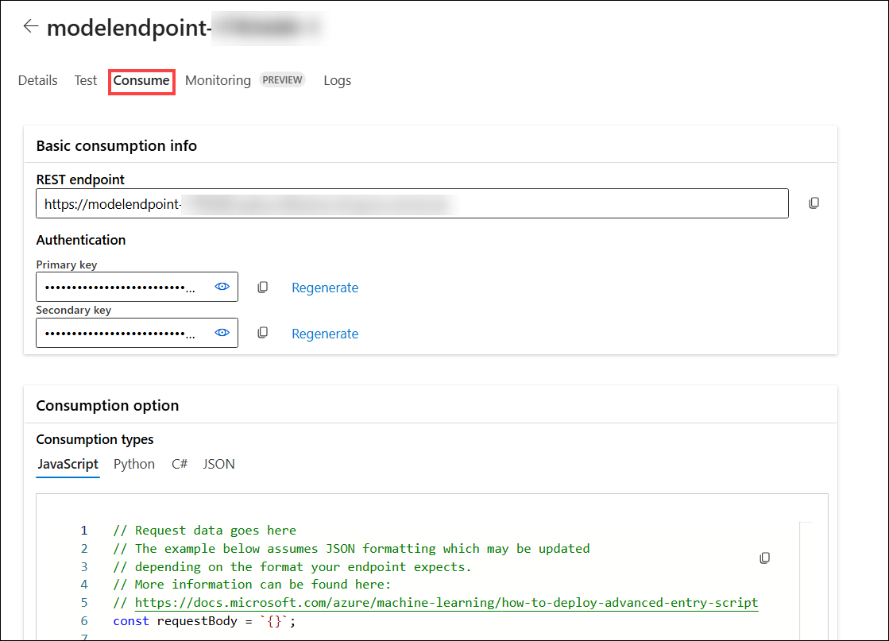

> **Congratulations** on completing the task! Now, it's time to validate it. Here are the steps:
> - Hit the Validate button for the corresponding task.
> - If you receive a success message, you can proceed to the next task.
> - If not, carefully read the error message and retry the step, following the instructions in the lab guide. 
> - If you need any assistance, please contact us at cloudlabs-support@spektrasystems.com. We are available 24/7 to help you out.
<validation step="6fd9456e-0099-45f5-af25-0953d6ef0695" />

## Review
In this lab you have completed the following tasks:
- Designed and Implemented a Chat Flow
- Used LLM and Prompt Tools in Flows

### You have successfully completed the lab. Click on **Next >>** to proceed with the next exercise.
