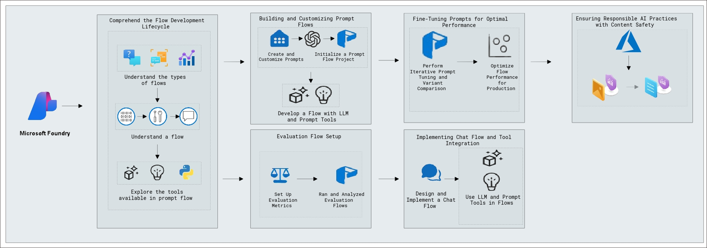
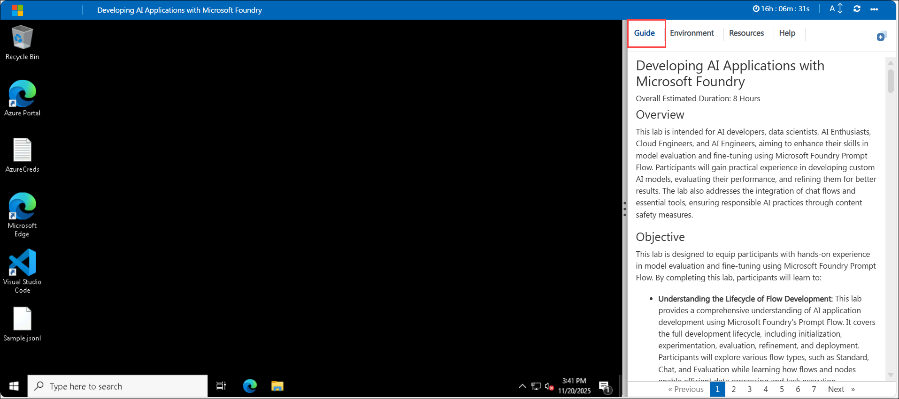
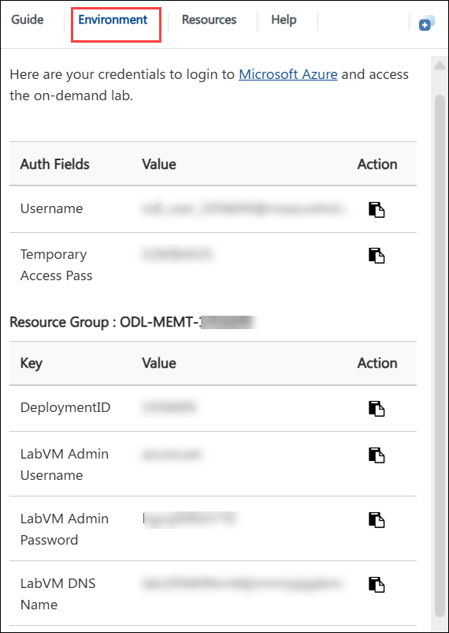
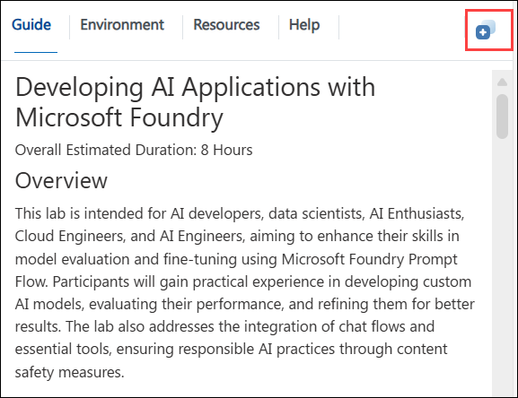
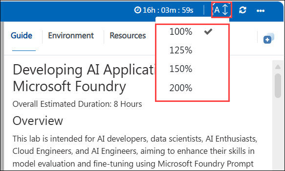

# Developing AI Applications with Microsoft Foundry

#### Overall Estimated Duration: 8 Hours

## Overview

This lab is intended for AI developers, data scientists, AI Enthusiasts, Cloud Engineers, and AI Engineers, aiming to enhance their skills in model evaluation and fine-tuning using Microsoft Foundry Prompt Flow. Participants will gain practical experience in developing custom AI models, evaluating their performance, and refining them for better results. The lab also addresses the integration of chat flows and essential tools, ensuring responsible AI practices through content safety measures.

## Objective 

This lab is designed to equip participants with hands-on experience in model evaluation and fine-tuning using Microsoft Foundry Prompt Flow. By completing this lab, participants will learn to:

- **Understanding the Lifecycle of Flow Development:** This lab provides a comprehensive understanding of AI application development using Microsoft Foundry's Prompt Flow. It covers the full development lifecycle, including initialization, experimentation, evaluation, refinement, and deployment. Participants will explore various flow types, such as Standard, Chat, and Evaluation while learning how flows and nodes enable efficient data processing and task execution.

- **Building and Customizing Prompt Flows:** In this lab, you will gain practical experience in setting up and managing a Prompt Flow project within Microsoft Foundry. You will begin by initializing the project and configuring the development environment to support the creation, testing, and refinement of AI applications. The lab will guide you through designing and customizing prompts, starting with the creation of a new flow, integrating the Prompt tool, and incorporating Large Language Model (LLM) capabilities. By building and executing a sample flow with custom inputs, you will learn how to monitor execution, analyze outputs, and refine workflows, providing a comprehensive understanding of AI-driven application development.

- **Evaluation Flow Setup:** This lab focuses on setting up and analyzing evaluation flows for an AI model in Microsoft Foundry. You will systematically review model responses to diverse inputs, assessing performance based on key evaluation criteria. By defining and applying metrics like coherence and fluency, you will automate the evaluation process using a structured dataset. Through this hands-on experience, you will develop a deeper understanding of model assessment techniques and optimization strategies to improve AI performance.

- **Fine-Tuning Prompts for Optimal Performance:** This lab focuses on fine-tuning prompts to optimize AI model performance and enhance response quality. You will explore techniques for iterative prompt refinement, evaluate different prompt variations, and analyze their impact on model outputs. Additionally, you will work on optimizing flow performance to ensure efficiency and reliability in production environments. By the end of this lab, you will have a deeper understanding of how to systematically improve AI-generated responses and streamline workflow execution for real-world applications.

- **Implementing Chat Flow and Tool Integration:** Implementing and testing chat flows involves creating and evaluating the interactions between a user and a chatbot or automated messaging system. This process begins with designing the conversation paths, including potential user inputs and corresponding system responses, to ensure that the chatbot can effectively address various scenarios. After implementation, thorough testing is conducted to identify and rectify any issues, ensuring the chat flow is intuitive, accurate, and capable of handling diverse user interactions. The goal is to deliver a seamless and efficient user experience, refining the chat flow based on test results to improve functionality and user satisfaction.

- **Ensure Responsible AI Practices AI with Content Safety:** This lab offers hands-on experience in applying responsible AI principles using Microsoft Foundry. Participants will explore key aspects such as fairness, transparency, privacy, and security while utilizing Azure’s built-in Responsible AI tools. The session focuses on identifying and addressing biases, enhancing model interpretability, implementing privacy-preserving techniques, and ensuring security and compliance adherence.

## Prerequisites 

Participants should have:
Basic knowledge and understanding of the following

 - Azure Portal
 - Microsoft Foundry

## Architecture

This architecture flow demonstrates the end-to-end lifecycle of developing AI solutions using Microsoft Foundry. It begins with understanding different types of flows and how they function, followed by building and customizing prompt flows using LLMs and integrated tools. You’ll then evaluate the flow’s performance with structured metrics, fine-tune prompts for optimal output, and implement chat-based flows for interactive experiences. Finally, the architecture ensures responsible AI practices by applying content safety controls to detect and mitigate harmful or inappropriate outputs, enabling the creation of secure, efficient AI applications.

## Architecture Diagram: 

  

## Explanation of Components

The architecture for this lab involves the following key components:

- **Microsoft Foundry:** The main platform used to build, customize, evaluate, and deploy AI-powered prompt flows and agents. Acts as the end-to-end orchestration layer.
- **Prompt Flow:** A visual tool inside Microsoft Foundry that allows you to chain together steps like input nodes, prompt tools, LLM calls, and post-processing using Python.
- **Python:** Used for writing custom code blocks within prompt flows, for example, data preprocessing, calling external APIs, or transforming LLM outputs.
- **GPT-based Language Models:** These models are used in LLM nodes within the Prompt Flows to perform tasks such as summarization, classification, or chat completions.
- **LLM Nodes:** Represent connections to foundation models like GPT-4, GPT-35-turbo. These nodes are used to perform tasks such as summarization, classification, or chat completion.
- **Prompt Tool:** The component that defines the input prompt format passed into an LLM node. Supports prompt variants for A/B testing.
- **Content Safety & Responsible AI (Azure Shield + Document Icons):** Ensures your flows follow ethical and secure practices. This includes moderation filters, content controls, and transparency safeguards.
  
## Getting Started with the Lab

We've prepared a seamless environment for you to explore and learn about the connection between creating, evaluating, and fine-tuning AI models using Prompt Flow. You'll develop custom AI models, automate evaluations, fine-tune performance, and integrate chat flows, all while ensuring responsible AI practices with Content Safety Studio. Let's begin by making the most of this experience:

## Accessing Your Lab Environment

Once you're ready to dive in, your virtual machine and **Guide** will be right at your fingertips within your web browser.

 

## Virtual Machine & Lab Guide

Your virtual machine is your workhorse throughout the workshop. The lab guide is your roadmap to success.

## Exploring Your Lab Resources

To get a better understanding of your lab resources and credentials, navigate to the **Environment** tab.

 

## Utilizing the Split Window Feature

For convenience, you can open the lab guide in a separate window by selecting the **Split Window** button from the Top right corner.

 

## Managing Your Virtual Machine

Feel free to **Start, Stop, or Restart (2)** your virtual machine as needed from the **Resources (1)** tab. Your experience is in your hands!

   

## Lab Guide Zoom In/Zoom Out

To adjust the zoom level for the environment page, click the **A↕: 100%** icon located next to the timer in the lab environment.

  

## Let's Get Started with Azure Portal

1. On your virtual machine, click on the Azure Portal icon as shown below:

   

1. You'll see the **Sign into Microsoft Azure** tab. Here, enter your credentials:

   - **Email/Username:** <inject key="AzureAdUserEmail"></inject>

       

1. Next, provide your password and click on **Sign in**

   - **Password:** <inject key="AzureAdUserPassword"></inject>

       

1. When prompted to stay signed in, click **Yes**.

1. If a **Welcome to Microsoft Azure** pop-up window appears, simply click **Cancel** to skip the tour.

## Support Contact

The CloudLabs support team is available 24/7, 365 days a year, via email and live chat to ensure seamless assistance at any time. We offer dedicated support channels tailored specifically for both learners and instructors, ensuring that all your needs are promptly and efficiently addressed.

  Learner Support Contacts:

   - Email Support: cloudlabs-support@spektrasystems.com
   - Live Chat Support: https://cloudlabs.ai/labs-support

Now, click on **Next** from the lower right corner to move on to the next page.

   

### Happy Learning!!
