# Lab 01: Training the Model

## Estimated Duration: 30 Minutes

## Lab scenario

In this lab, you will gain hands-on experience in initializing a Prompt Flow project in Microsoft Foundry, setting up the necessary environment to begin developing, testing, and refining AI applications. You will create and customize prompts within Microsoft Foundry Prompt Flow. Starting with the creation of a new flow, you will add and configure the Prompt tool and develop a flow incorporating LLM (Large Language Model) and Prompt tools. By authoring a sample flow and running it with custom inputs, you'll learn how to monitor flow execution and evaluate outputs, thereby understanding the practical steps involved in developing, testing, and refining AI-driven workflows.

## Lab objectives
In this lab, you will perform the following:

- Task 1 : Initialize a Prompt Flow Project
- Task 2 : Create and Customize Prompts
- Task 3 : Develop a Flow with LLM and Prompt Tools

## Task 1: Initialize a Prompt Flow Project

As involves setting up a structured environment to manage and streamline prompt-based AI tasks. This process typically includes creating a project directory, configuring necessary files and dependencies, and establishing a workflow for prompt design, testing, and iteration. By organizing prompts, data, and evaluation metrics in a centralized system, the project ensures consistent and efficient development, making it easier to refine prompts and achieve desired outcomes.

1. On the Azure portal, search for **Microsoft Foundry (1)** and select **Microsoft Foundry (2)** from the results.

    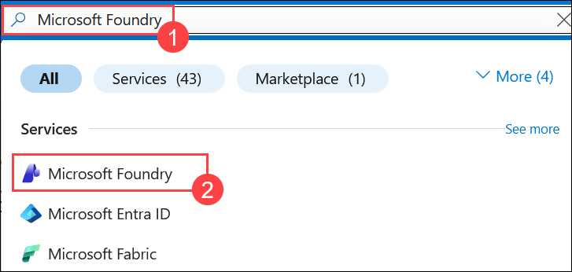

1. On the **Microsoft Foundry** home page, expand **Use with Foundry (1)** on the left pane.

1. Click on **AI Hubs (2)** and then select **+ Create (3)** followed by **Hub (4)**.

    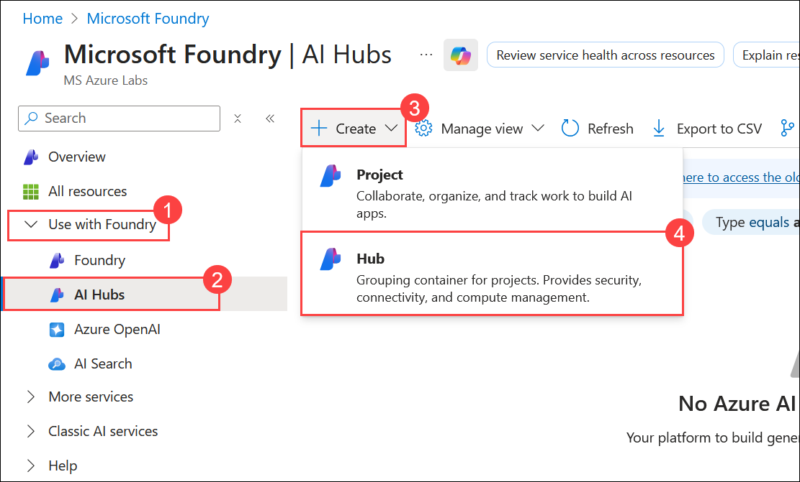

1. On the **Azure AI hub** page, follow these instructions to fill out the properties:

   - Subscription: **Keep it as default (1)**
   - Resource group: **ODL-MEMT-<inject key="DeploymentID" enableCopy="false"/>  (2)**  
   - Region: **<inject key="Region" enableCopy="false"/>  (3)**
   - Name: **modelhub<inject key="DeploymentID" enableCopy="false"/>  (4)** 
   - Friendly name: **Keep it as default (5)**
   - Default project resource group: **Keep it as default (6)**
   - Connect AI Services incl. OpenAI: **Keep it as default (7)**
   - Select **Review + create (8)**

       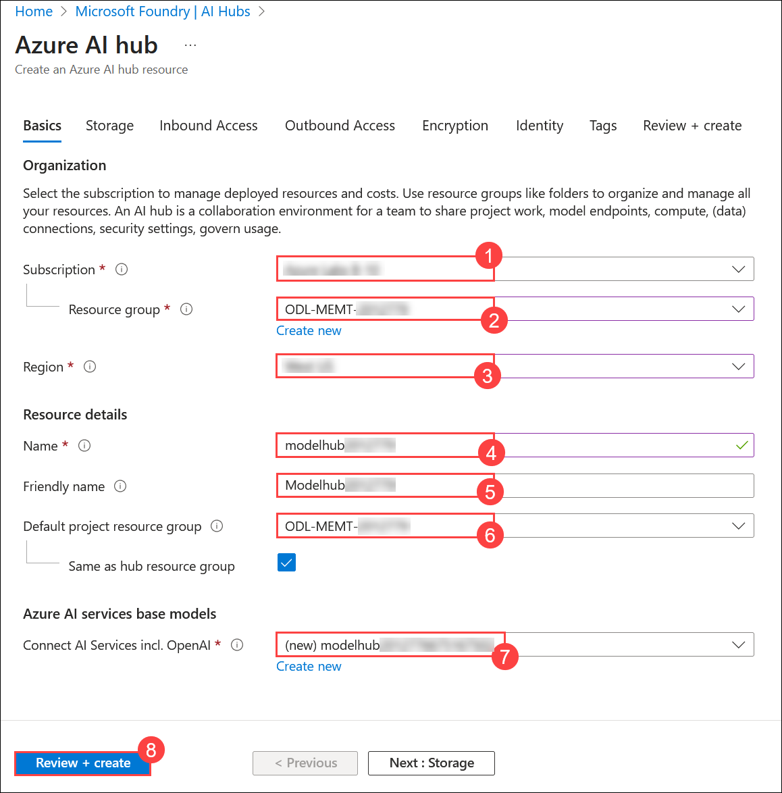

1. Once the validation is passed, click **Create**.

    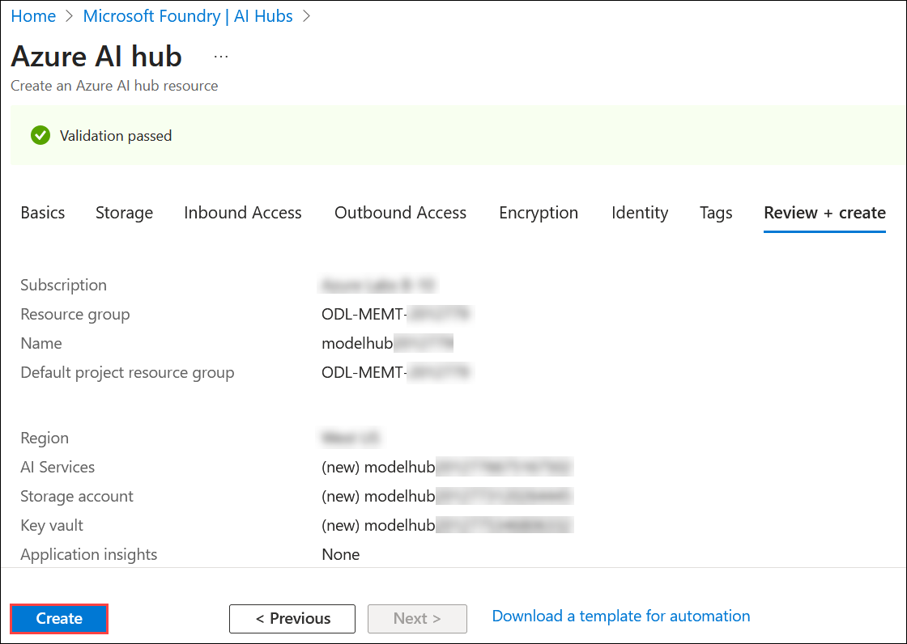

1. Once the deployment gets completed click on **Go to resource**, and select **Launch Azure AI Foundry** (1).

    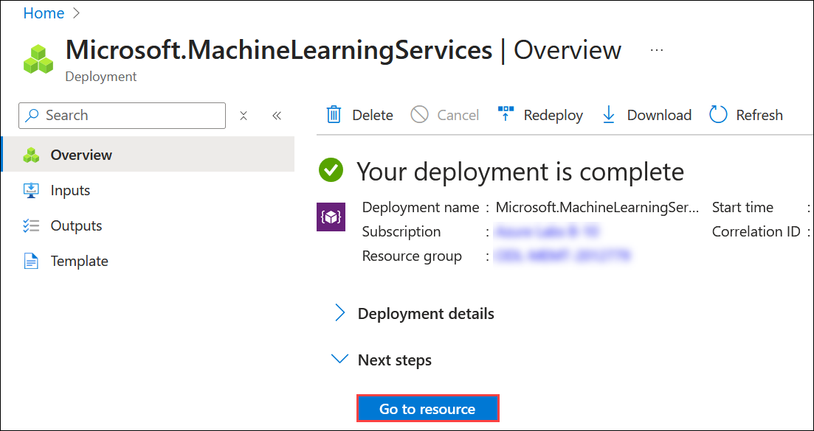

    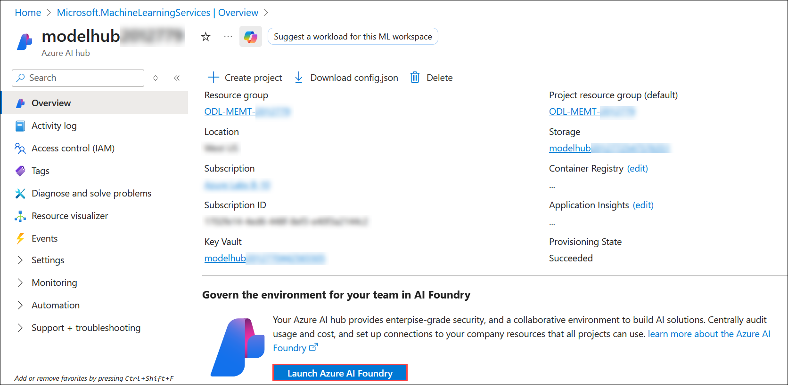

1. Select **+ New Project (1)**, enter the Project name as **modelproject-<inject key="DeploymentID" enableCopy="false"/>** **(2)** and click on **Create (3)**.

    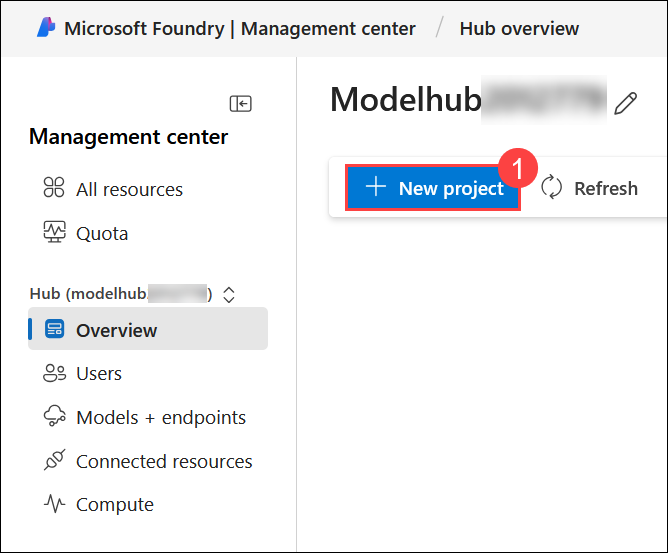

    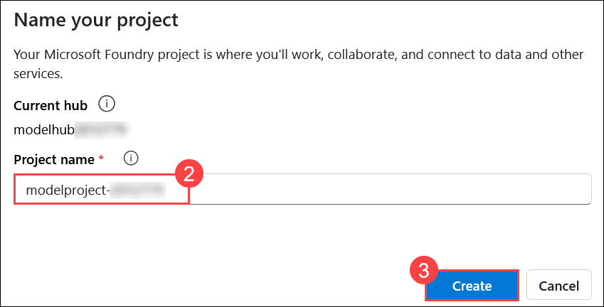

    > **Note:** This step takes around 2-3 minutes to complete. Proceed with the following tasks once the process is finished.
     
> **Congratulations** on completing the task! Now, it's time to validate it. Here are the steps:
> - If you receive a success message, you can proceed to the next task.
> - If not, carefully read the error message and retry the step, following the instructions in the lab guide. 
> - If you need any assistance, please contact us at cloudlabs-support@spektrasystems.com. We are available 24/7 to help you out.
<validation step="67a8c4cc-2f47-4e0a-9106-7388c2aa8e8e" />

### Task 2 : Create and Customize Prompts

Creating and customizing prompts involves designing specific, targeted questions or statements to elicit desired responses or actions. This process includes defining clear objectives, understanding the audience, and using precise language to ensure clarity and relevance. Customization can further refine prompts to align with particular contexts or user needs, enhancing engagement and effectiveness in various applications such as education, customer service, and AI interactions.

1. From the left navigation menu, under **My assets**, select **Model + endpoints (1)**. On the **Manage deployments of your models, apps, and services**, under **Model deployments** tab, select **+ Deploy model (2)** and then choose **+ Deploy base model (3)** from the dropdown list.

    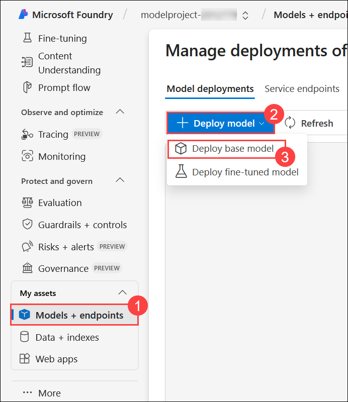

1. On the **Select a model** page, search **gpt-4o (1)** and select model **gpt-4o (2)** and click **Confirm (3)**.

    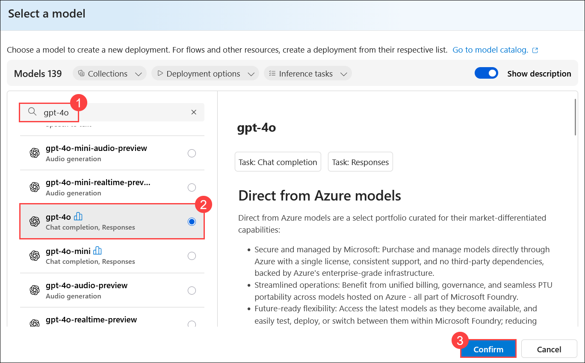

1. On **Deploy model gpt-4** page, follow these instructions to create the deployment:

    - Deployment name : **gpt-4o (1)**
    - Deployment type :  **Standard (2)**
    - Model version : **2024-11-20 (3)**
    - AI resource : Make sure to select which contain your deployment id **modelhub<inject key="DeploymentID" enableCopy="false"/>xxxxxxxx** **(4)**
    - Tokens per Minute Rate Limit (thousands): **8K (5)**
      > **Note**: Use the &rarr; (right arrow) key on the keyboard to set the Enqueued Tokens (Limit) to 8K.
    - Content filter : **DefaultV2 (6)**
    - Select **Connect and deploy (7)**

        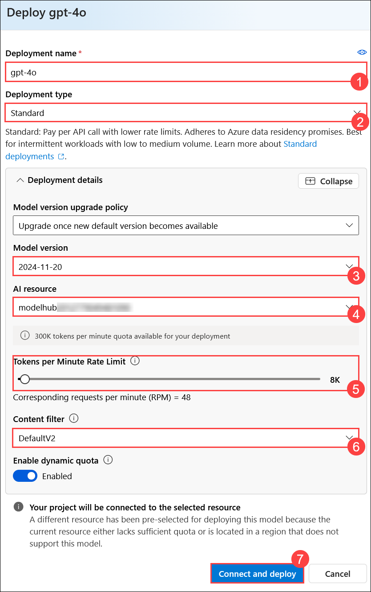

1. From the left navigation pane, select **Prompt flow (1)** **>** **+ Create (2)** to add the Prompt tool to your flow.

    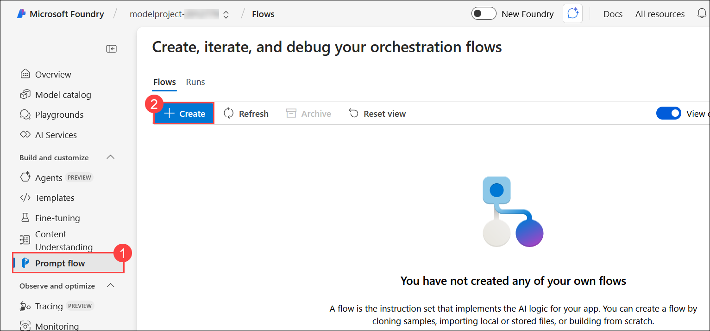

1. On **Create a new flow** blade, under **Standard flow**, click on **Create (1)**, then enter **promptflow-<inject key="DeploymentID" enableCopy="false"/> (2)** for Folder name, then click on **Create (3)**.

    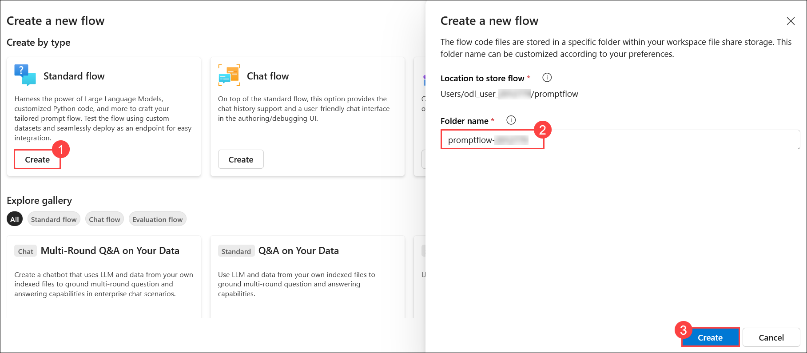

    >**Note:** If you encounter any permission errors, wait for 5 minutes and recreate the prompt flow with a unique name when you see the Folder name already exists error. Once the flow is created, rename it to **promptflow-<inject key="DeploymentID" enableCopy="false"/>** **(2)** by selecting the **edit (1)** icon and click on **Save (3)**.

    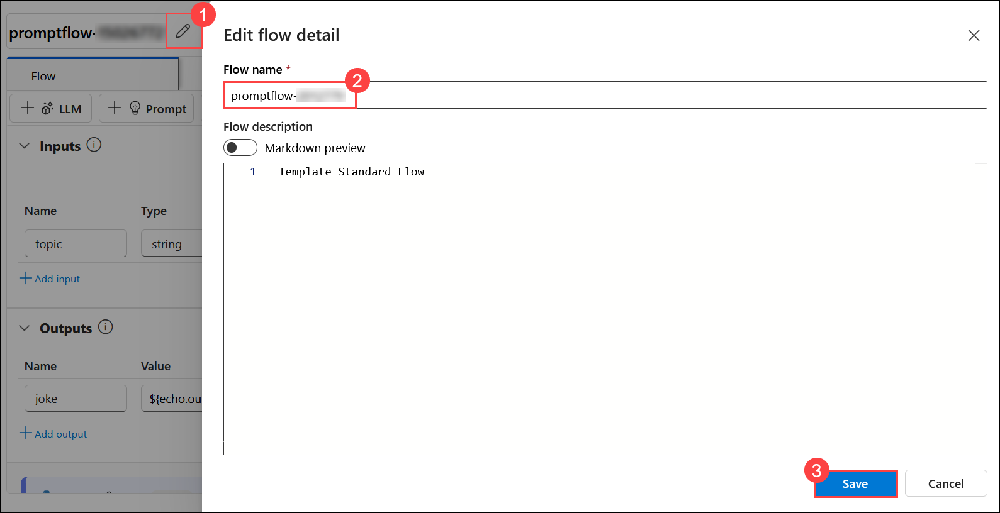 

> **Congratulations** on completing the task! Now, it's time to validate it. Here are the steps:
> - If you receive a success message, you can proceed to the next task.
> - If not, carefully read the error message and retry the step, following the instructions in the lab guide. 
> - If you need any assistance, please contact us at cloudlabs-support@spektrasystems.com. We are available 24/7 to help you out.
<validation step="0087cf7b-6658-4272-9a9a-15ffc66c12bf" />

### Task 3 : Develop a Flow with LLM and Prompt Tools

Developing a flow with Large Language Models (LLMs) and prompt tools involves designing a structured interaction where the LLM is guided by carefully crafted prompts to generate desired outputs. This process typically includes defining the objective, selecting appropriate LLMs, and iteratively refining prompts based on the model's responses to ensure accuracy and relevance. Prompt tools assist in managing and optimizing this interaction, enabling more efficient and effective use of LLMs in tasks such as content creation, data analysis, and automated customer support.

1. The prompt flow authoring page opens. You can start authoring your flow now. By default you see a sample flow. This example flow has nodes for the LLM and Python tools.

1. Optionally, you can add more tools to the flow. The visible tool options are **LLM, Prompt, and Python**. To view more tools, select **+ More tools**.

1. From the **Graph**, select **joke (1)**. Choose an existing connection **modelhub<inject key="DeploymentID" enableCopy="false"/>xxxxxxxx_aoai (2)** from the drop-down menu, and for deployment, select the newly created deployment, **gpt-4o (3)**, in the LLM tool editor.

    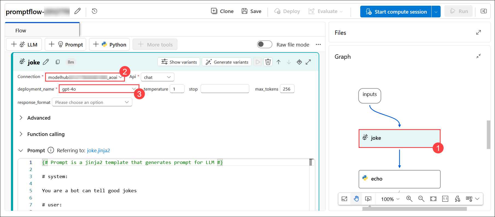

1. Scroll up, and for **Input**, enter any fruit name of your choice (e.g. **'Apple' (1)** ).

1. Select **Save (2)**, and select **Start compute session (3)**.

    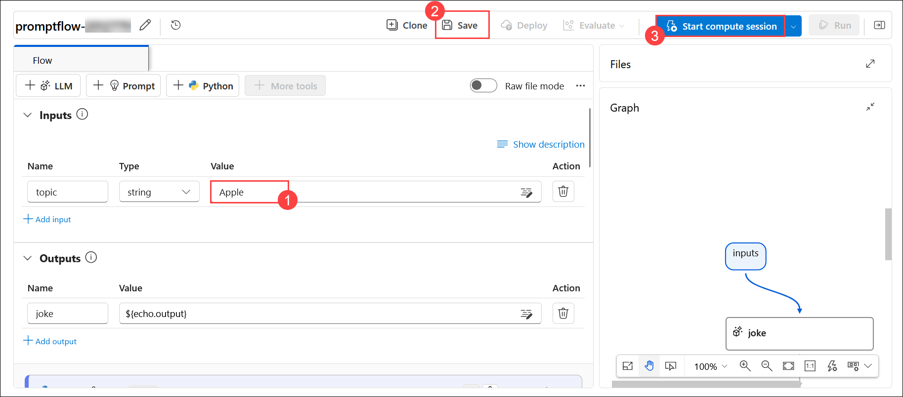

    >**Note:** It might take 10-15 minutes to start the session. Wait till compute session starts.
    
1. Once the compute session is complete, click the play button to **run** the **joke node** first, then **run** the **echo node**.

    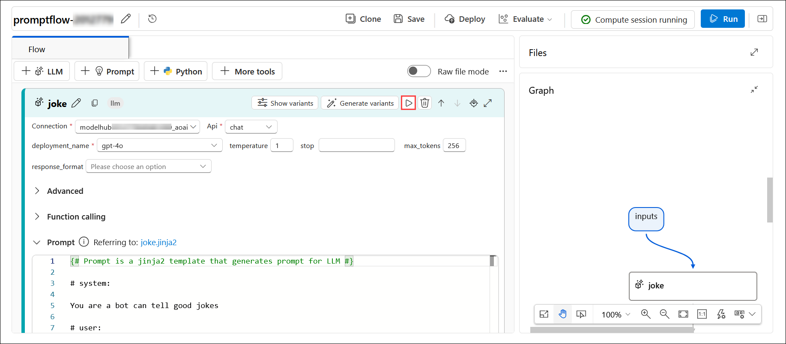

    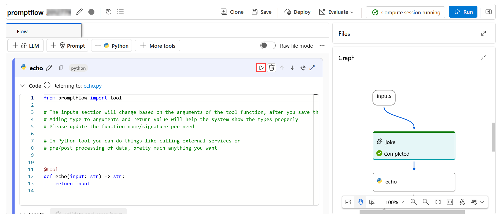
  
1. Once all nodes have successfully executed, select **Run** from the toolbar.

    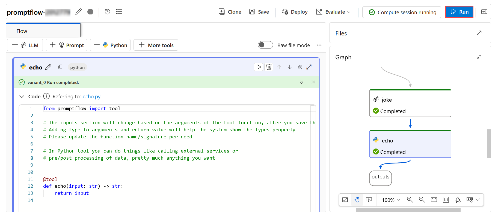

1. Once the flow run is completed, select **View full output** to view the flow results. The output will look similar to the image as shown below.

    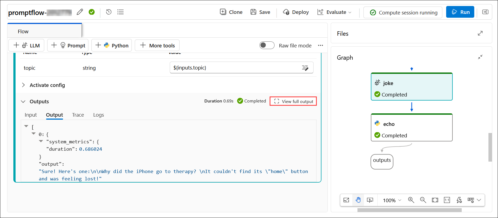

1. You can view the flow run status and output in the Outputs section.

     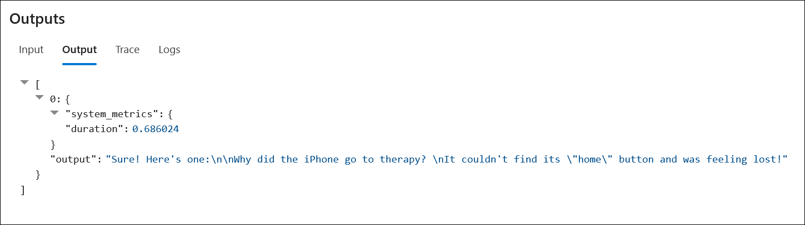

1. From the top menu, select **+ Prompt (1)** to add the Prompt tool to your flow, give the name of the flow as **modelflow (2)**, and select **Add (3)**.

     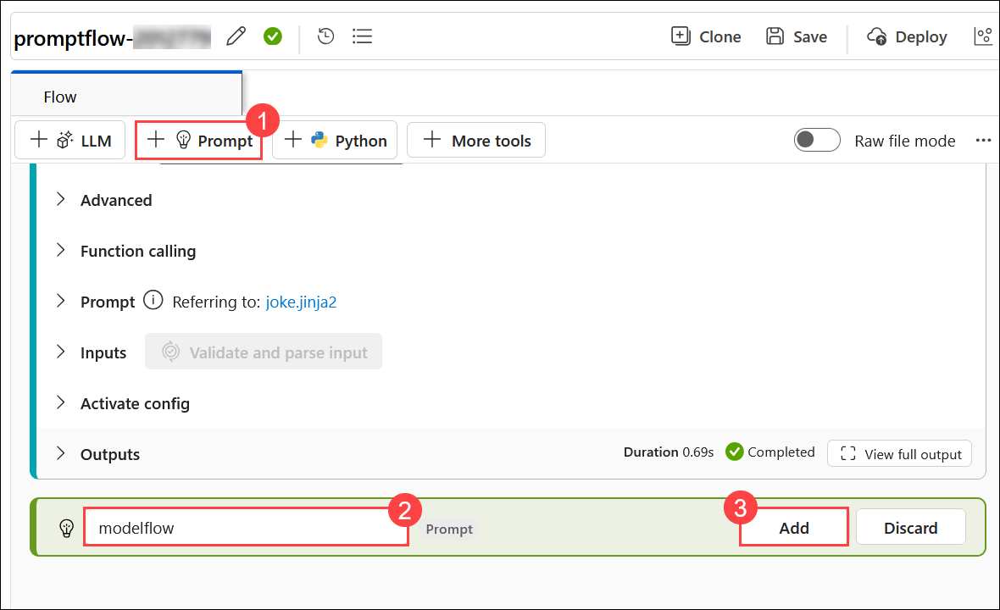

1. Add this **code (1)** inside the **modelflow** prompt tool, and select **Validate and parse input (2)**.

    ```jinja
    Welcome to {{ website_name }}!
    
    Hello, {{ user_name }}!
    
    Hello there!
    
    Please select an option from the menu below:
    1. View your account
    2. Update personal information
    3. Browse available products
    4. Contact customer support
    ```

      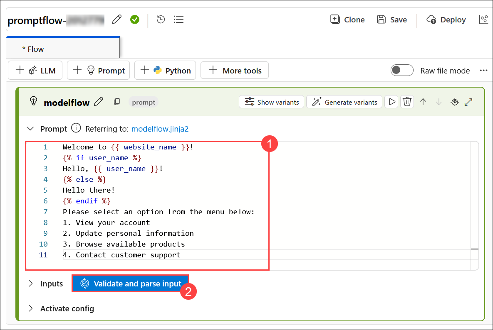
   
1. In the **Inputs section (1)** add these following value, then select **Save (2)** and **Run (3)**.

    - user_name: **Jane**
    - website_name: **Microsoft**

       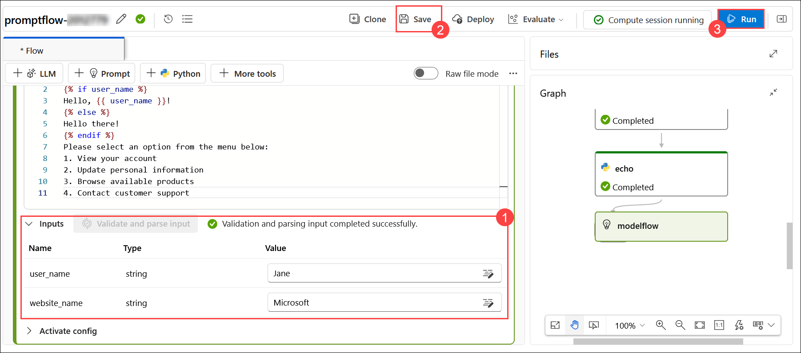

1. If you encounter any warnings while running, as shown in the screenshot below, click **Run Anyway**.

      

1. Once the flow run is completed, select **View full output** to view the flow results. The output will look similar to the image as shown below.

     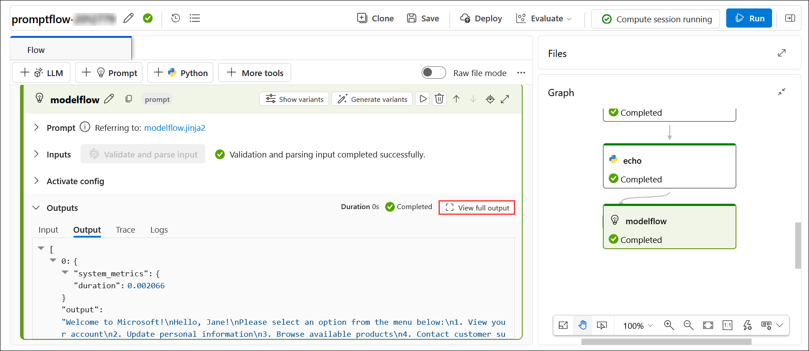

1. You can view the flow run status and output in the Outputs section.

     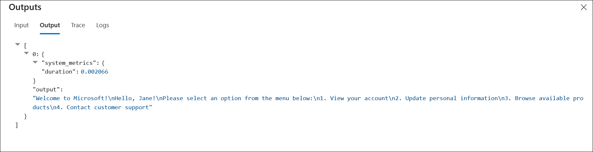
   
## Review
In this lab you have completed the following tasks:

- Initialize a Prompt Flow Project
- Created and Customized Prompts
- Developed a Flow with LLM and Prompt Tools

## You have successfully completed the lab. Now, click on **Next >>** from the lower right corner to proceed on to the next lab.

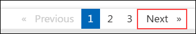
